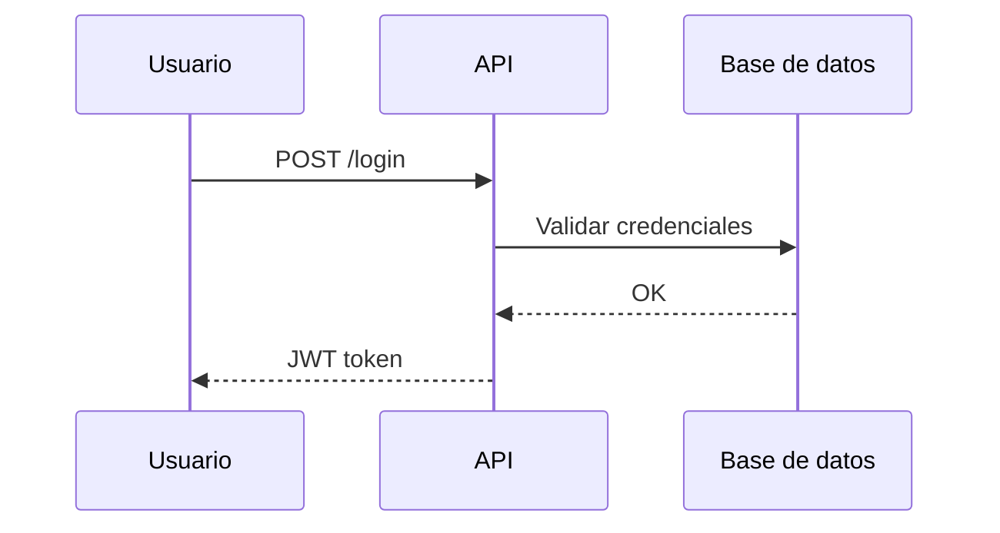

# Diagramas con Draw.io MCP

## Objetivo

Crear diagramas de arquitectura, flujos, organigramas y visualizaciones usando el MCP oficial de Draw.io (`drawio-mcp`).

## Herramientas disponibles

| Herramienta | Uso | Formato |
|-------------|-----|---------|
| `open_drawio_mermaid` | Flujos, secuencias, ER, arquitectura | Sintaxis Mermaid.js |
| `open_drawio_csv` | Organigramas, jerarquías tabulares | CSV |
| `open_drawio_xml` | Diagramas nativos draw.io/mxGraph (máximo control) | XML draw.io |

## Cuándo usar cada herramienta

- **Mermaid**: Flujos, secuencias, arquitectura de componentes, diagramas ER. Opción más rápida y legible.
- **CSV**: Organigramas (CEO → CTO, CFO; CTO → Engineers), jerarquías tabulares.
- **XML**: Cuando se necesiten estilos específicos o diagramas muy detallados en formato nativo.

## Instrucciones

1. Determinar el tipo de diagrama y elegir la herramienta adecuada.
2. Generar el contenido en el formato correspondiente (Mermaid, CSV o XML).
3. Llamar al MCP `drawio-mcp` con el tool correspondiente.
4. Entregar al usuario la URL que devuelve el MCP para abrir el diagrama en draw.io.

## Parámetros comunes

- `content` (string, requerido): Contenido del diagrama.
- `lightbox` (boolean, opcional): Modo solo lectura (default: false).
- `dark` (string, opcional): `"auto"`, `"true"` o `"false"` (default: `"auto"`).

## Ejemplo Mermaid (diagrama de secuencia)



## Ejemplo CSV (organigrama)

```csv
Nombre,Rol,Reporta a
CEO,Director Ejecutivo,
CTO,Director Técnico,CEO
CFO,Director Financiero,CEO
Eng1,Ingeniero,CTO
Eng2,Ingeniero,CTO
```

## Restricciones

- Requiere Node.js (v20+) y `npx` para ejecutar el MCP.
- El MCP debe estar configurado en `~/.kiro/settings/mcp.json` o `.kiro/settings/mcp.json` como `drawio-mcp`.
- Para guardar como archivo `.drawio`, el usuario puede exportar desde draw.io (File → Export as → .drawio) tras abrir la URL.
