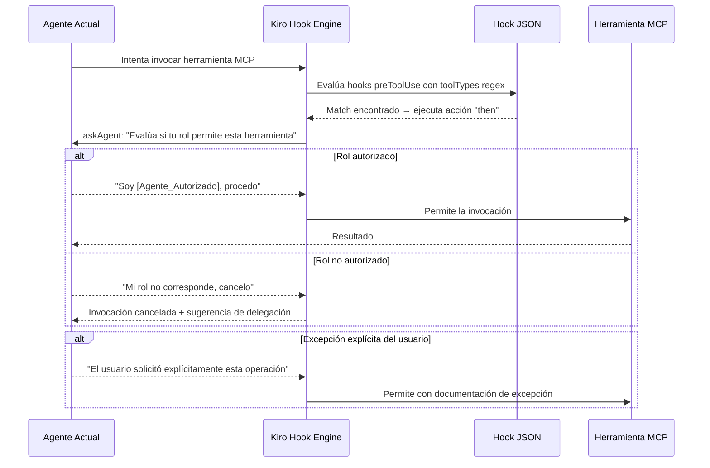
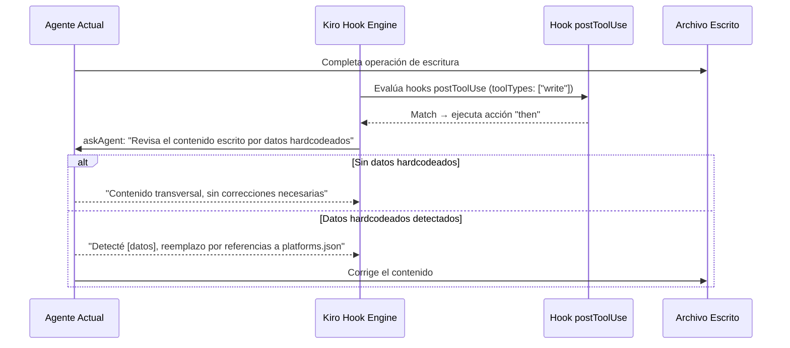
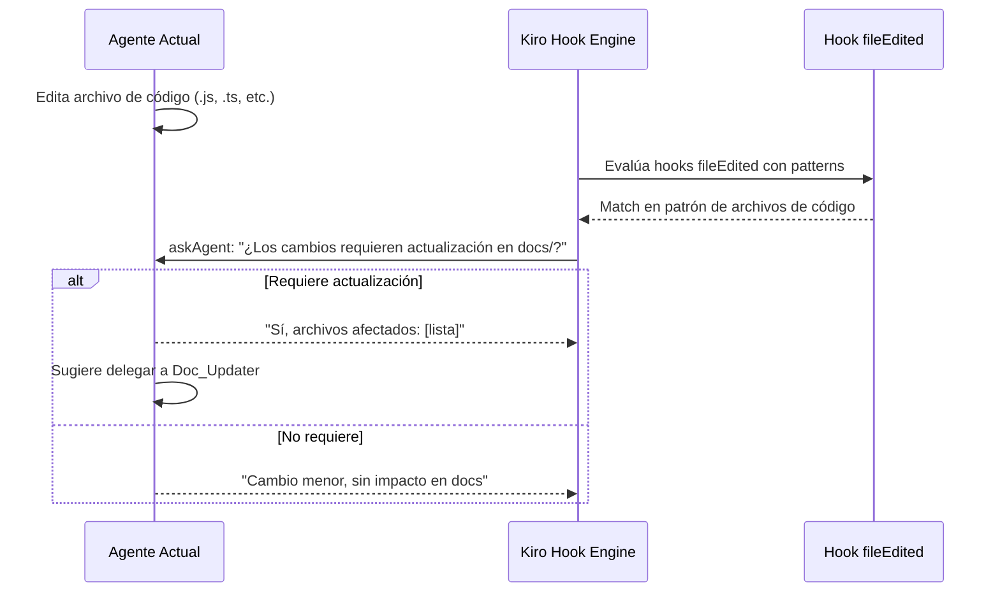
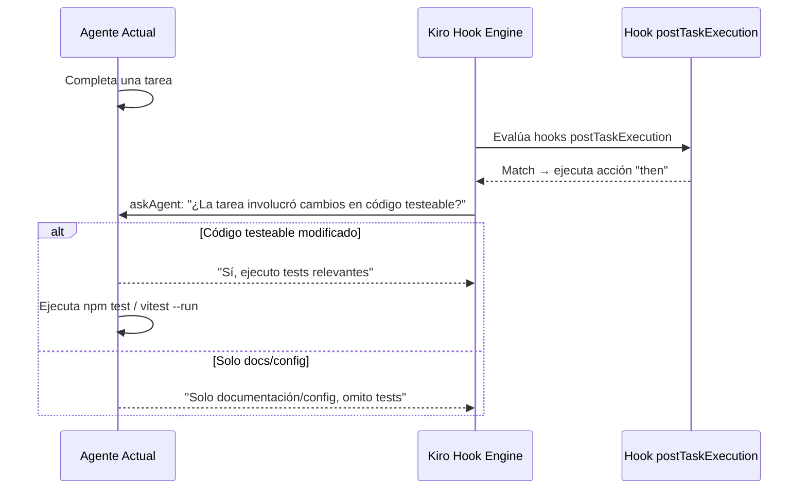

# Documento de Diseño — Agent Hooks para Enforcement del Enjambre

## Visión General

Este diseño define la implementación de Kiro Agent Hooks como mecanismo de enforcement activo para las políticas de dominio del enjambre de agentes. Actualmente, las restricciones de qué agente puede usar qué herramienta MCP se definen como convenciones textuales en archivos de steering (`.kiro/steering/`) y rules (`.cursor/rules/`). Los hooks transforman estas convenciones pasivas en checkpoints de autorización activos que interceptan llamadas a herramientas y operaciones de archivos en tiempo real.

### Decisiones de Diseño Clave

1. **Self-evaluation via prompt**: Dado que Kiro hooks no tienen acceso nativo a la identidad del agente actual, cada hook usa `askAgent` con un prompt que instruye al agente a auto-evaluar su rol comparándolo con los archivos de steering activos.
2. **Regex sobre toolTypes**: Los hooks `preToolUse` usan patrones regex en `toolTypes` para interceptar herramientas MCP por nombre, permitiendo capturar variaciones de nombres de herramientas sin listar cada una explícitamente.
3. **Prompts agnósticos**: Todos los prompts de hooks son transversales — no referencian proyectos, URLs ni IDs específicos de ninguna plataforma.
4. **Un archivo JSON por hook**: Cada hook es un archivo independiente en `.kiro/hooks/`, siguiendo la convención `{dominio}-{tipo-de-guardia}.json`, lo que permite añadir o remover guardias sin afectar las existentes.

## Arquitectura

### Flujo de Interceptación



### Flujo postToolUse (Validación Agnóstico/Particular)



### Flujo fileEdited (Recordatorio de Documentación)



### Flujo postTaskExecution (Ejecución de Tests)



### Mapa de Hooks por Tipo

| Hook | Tipo | toolTypes / patterns | Agente(s) Autorizado(s) |
|------|------|---------------------|------------------------|
| clarity-mcp-guard | preToolUse | `[".*clarity.*"]` | Clarity_Behavior |
| devtools-mcp-guard | preToolUse | `[".*chrome.devtools.*"]` | Guardian (skill prueba) |
| atlassian-write-guard | preToolUse | `[".*atlassian.*(create\|update\|edit\|delete).*"]` | Scout, PO_Agile |
| datadog-mcp-guard | preToolUse | `[".*datadog.*"]` | Cloud_Datadog |
| github-mcp-guard | preToolUse | `[".*github.*"]` | GitHub_Repos |
| agnostic-write-validator | postToolUse | `["write"]` | Todos (validación transversal) |
| doc-update-reminder | fileEdited | `["**/*.js", "**/*.ts", ...]` | Todos (recordatorio) |
| test-runner-post-task | postTaskExecution | N/A | Todos (validación) |

## Componentes e Interfaces

### Estructura de Directorio

```
.kiro/
└── hooks/
    ├── clarity-mcp-guard.json          # Req 1: Guardia Clarity
    ├── devtools-mcp-guard.json         # Req 2: Guardia Chrome DevTools
    ├── atlassian-write-guard.json      # Req 3: Guardia escritura Atlassian
    ├── datadog-mcp-guard.json          # Req 4: Guardia Datadog
    ├── github-mcp-guard.json           # Req 8: Guardia GitHub
    ├── agnostic-write-validator.json   # Req 5: Validación agnóstico/particular
    ├── doc-update-reminder.json        # Req 6: Recordatorio docs
    └── test-runner-post-task.json      # Req 7: Ejecución tests post-tarea
```

### Esquema de Hook (Interfaz Común)

Cada archivo JSON sigue el esquema de Kiro hooks:

```typescript
interface KiroHook {
  name: string;                    // Identificador legible del hook
  version: string;                 // Semver, "1.0.0" para esta implementación
  description?: string;            // Descripción opcional del propósito
  when: {
    type: "preToolUse" | "postToolUse" | "fileEdited" | "postTaskExecution";
    toolTypes?: string[];          // Categorías built-in o regex para MCP tools
    patterns?: string[];           // Glob patterns para fileEdited
  };
  then: {
    type: "askAgent" | "runCommand";
    prompt?: string;               // Para askAgent: instrucción de auto-evaluación
    command?: string;              // Para runCommand: comando a ejecutar
  };
}
```

### Especificación de Cada Hook

#### 1. clarity-mcp-guard.json (Requisito 1)

```json
{
  "name": "clarity-mcp-guard",
  "version": "1.0.0",
  "description": "Guardia de acceso a herramientas MCP de Microsoft Clarity. Solo el agente Clarity_Behavior debe invocarlas.",
  "when": {
    "type": "preToolUse",
    "toolTypes": [".*clarity.*"]
  },
  "then": {
    "type": "askAgent",
    "prompt": "CHECKPOINT DE DOMINIO — Clarity MCP.\n\nEstás a punto de invocar una herramienta del MCP de Microsoft Clarity (query-analytics-dashboard, list-session-recordings, query-documentation-resources).\n\nEvalúa lo siguiente:\n1. Revisa los archivos de steering activos en tu contexto. ¿Tu rol actual corresponde al agente Clarity_Behavior (especialista en comportamiento de usuarios y analítica Clarity)?\n2. Si tu rol NO es Clarity_Behavior: CANCELA esta invocación. Sugiere al usuario delegar esta tarea al agente Clarity_Behavior a través del Orquestador.\n3. EXCEPCIÓN: Si el usuario ha solicitado EXPLÍCITAMENTE en este mismo turno una correlación entre Clarity y otro dominio (por ejemplo, Clarity + tests E2E), documenta la excepción y procede.\n\nResponde con tu evaluación antes de continuar."
  }
}
```

#### 2. devtools-mcp-guard.json (Requisito 2)

```json
{
  "name": "devtools-mcp-guard",
  "version": "1.0.0",
  "description": "Guardia de acceso a herramientas MCP de Chrome DevTools. Solo el agente Guardian en contexto del skill prueba debe invocarlas.",
  "when": {
    "type": "preToolUse",
    "toolTypes": [".*chrome.devtools.*"]
  },
  "then": {
    "type": "askAgent",
    "prompt": "CHECKPOINT DE DOMINIO — Chrome DevTools MCP.\n\nEstás a punto de invocar una herramienta del MCP de Chrome DevTools (take_screenshot, take_snapshot, navigate_page, etc.).\n\nEvalúa lo siguiente:\n1. Revisa los archivos de steering activos en tu contexto. ¿Tu rol actual corresponde al agente Guardian (QA Specialist / Tech Guardian)?\n2. ¿La invocación ocurre dentro del contexto del skill prueba (validación E2E, tests Playwright)?\n3. Si tu rol NO es Guardian o NO estás en contexto del skill prueba: CANCELA esta invocación. Sugiere al usuario delegar al agente Guardian con el skill prueba.\n4. EXCEPCIÓN: Si el usuario ha solicitado EXPLÍCITAMENTE en este turno el uso de Chrome DevTools por otro agente, documenta la excepción y procede.\n\nResponde con tu evaluación antes de continuar."
  }
}
```

#### 3. atlassian-write-guard.json (Requisito 3)

```json
{
  "name": "atlassian-write-guard",
  "version": "1.0.0",
  "description": "Guardia de operaciones de escritura en Atlassian MCP. Solo los agentes Scout y PO_Agile pueden crear, actualizar o eliminar en Jira/Confluence.",
  "when": {
    "type": "preToolUse",
    "toolTypes": [".*atlassian.*(create|update|edit|delete).*"]
  },
  "then": {
    "type": "askAgent",
    "prompt": "CHECKPOINT DE DOMINIO — Atlassian Escritura.\n\nEstás a punto de invocar una operación de escritura en el MCP de Atlassian (crear, actualizar, editar o eliminar issues, páginas o comentarios en Jira/Confluence).\n\nEvalúa lo siguiente:\n1. Revisa los archivos de steering activos en tu contexto. ¿Tu rol actual corresponde al agente Scout (análisis Jira/Confluence) o PO_Agile (Product Owner / Agile Master)?\n2. Si tu rol NO es Scout ni PO_Agile: CANCELA esta operación de escritura. Sugiere al usuario delegar al agente Scout (para operaciones de análisis/tickets) o PO_Agile (para historias de usuario/backlog) según el tipo de operación.\n3. Si tu rol ES Scout o PO_Agile: procede sin restricción adicional.\n\nResponde con tu evaluación antes de continuar."
  }
}
```

#### 4. datadog-mcp-guard.json (Requisito 4)

```json
{
  "name": "datadog-mcp-guard",
  "version": "1.0.0",
  "description": "Guardia de acceso a herramientas MCP de Datadog. Solo el agente Cloud_Datadog debe invocarlas.",
  "when": {
    "type": "preToolUse",
    "toolTypes": [".*datadog.*"]
  },
  "then": {
    "type": "askAgent",
    "prompt": "CHECKPOINT DE DOMINIO — Datadog MCP.\n\nEstás a punto de invocar una herramienta del MCP de Datadog.\n\nEvalúa lo siguiente:\n1. Revisa los archivos de steering activos en tu contexto. ¿Tu rol actual corresponde al agente Cloud_Datadog (especialista en observabilidad y alertas Datadog)?\n2. Si tu rol NO es Cloud_Datadog: CANCELA esta invocación. Sugiere al usuario delegar la tarea al agente Cloud_Datadog a través del Orquestador.\n3. EXCEPCIÓN: Si el usuario ha solicitado EXPLÍCITAMENTE en este turno una correlación entre Datadog y otro dominio (por ejemplo, Datadog + código del repo), documenta la excepción y procede.\n\nResponde con tu evaluación antes de continuar."
  }
}
```

#### 5. github-mcp-guard.json (Requisito 8)

```json
{
  "name": "github-mcp-guard",
  "version": "1.0.0",
  "description": "Guardia de acceso a herramientas MCP de GitHub. Solo el agente GitHub_Repos debe invocarlas.",
  "when": {
    "type": "preToolUse",
    "toolTypes": [".*github.*"]
  },
  "then": {
    "type": "askAgent",
    "prompt": "CHECKPOINT DE DOMINIO — GitHub MCP.\n\nEstás a punto de invocar una herramienta del MCP de GitHub (get_file_contents, list_pull_requests, list_commits, list_branches, search_code, list_issues, search_repositories).\n\nEvalúa lo siguiente:\n1. Revisa los archivos de steering activos en tu contexto. ¿Tu rol actual corresponde al agente GitHub_Repos (especialista en lectura y análisis de repositorios de plataforma)?\n2. Si tu rol NO es GitHub_Repos: CANCELA esta invocación. Sugiere al usuario delegar la tarea al agente GitHub_Repos a través del Orquestador.\n3. EXCEPCIÓN: Si el usuario ha solicitado EXPLÍCITAMENTE en este turno una operación que requiere GitHub desde otro agente, documenta la excepción y procede.\n\nResponde con tu evaluación antes de continuar."
  }
}
```

#### 6. agnostic-write-validator.json (Requisito 5)

```json
{
  "name": "agnostic-write-validator",
  "version": "1.0.0",
  "description": "Validación post-escritura para detectar datos hardcodeados de plataforma específica. Aplica la regla agnóstico vs particular.",
  "when": {
    "type": "postToolUse",
    "toolTypes": ["write"]
  },
  "then": {
    "type": "askAgent",
    "prompt": "VALIDACIÓN AGNÓSTICO/PARTICULAR — Post-escritura.\n\nAcabas de completar una operación de escritura. Revisa el contenido escrito aplicando la regla de validación agnóstico vs particular.\n\nBusca estos patrones de datos hardcodeados:\n- URLs de producción específicas de una plataforma\n- Project keys de Jira (ej: GD768, PROJ-123)\n- IDs de dashboards de Datadog\n- Nombres de servicios concretos de una plataforma\n- IDs de monitores, alertas o tableros específicos\n- Tokens, API keys o credenciales\n\nReglas:\n1. Si el archivo está dentro de directorios designados como particulares (Workspace/*/config/, docs/data/): OMITE esta validación. Esos directorios están autorizados para contener datos específicos.\n2. Si detectas datos hardcodeados en archivos transversales (código fuente, templates, docs genéricos): REEMPLAZA los datos por referencias a platforms.json o variables de configuración.\n3. Si no detectas datos hardcodeados: confirma que el contenido es transversal y continúa.\n\nReporta tu evaluación."
  }
}
```

#### 7. doc-update-reminder.json (Requisito 6)

```json
{
  "name": "doc-update-reminder",
  "version": "1.0.0",
  "description": "Recordatorio de actualización de documentación cuando se editan archivos de código fuente.",
  "when": {
    "type": "fileEdited",
    "patterns": [
      "**/*.js",
      "**/*.ts",
      "**/*.tsx",
      "**/*.cjs",
      "**/*.mjs",
      "**/*.json",
      "!docs/**",
      "!node_modules/**",
      "!.kiro/**",
      "!.cursor/**"
    ]
  },
  "then": {
    "type": "askAgent",
    "prompt": "RECORDATORIO DE DOCUMENTACIÓN — Archivo de código editado.\n\nSe ha editado un archivo de código fuente. Evalúa si los cambios requieren actualización en la documentación.\n\nConsulta el mapeo del agente Doc_Updater:\n- scripts/, get-platform-config.js → docs/ESTRUCTURA.md, docs/resumen-proyecto.md, docs/onboarding/\n- tests/, playwright.config.js → docs/ESTRUCTURA.md, docs/architecture/\n- .cursor/rules/, agentes → docs/architecture/6-inventario-agentes.md, .cursor/README.md\n- Workspace/config/ → docs/templates/, docs/onboarding/\n- Nuevos comandos npm → docs/resumen-proyecto.md\n\nSi los cambios requieren actualización:\n1. Lista los archivos de documentación afectados.\n2. Sugiere delegar la actualización al agente Doc_Updater a través del Orquestador.\n\nSi los cambios son menores (refactoring interno, corrección de typos, cambios cosméticos sin impacto funcional): indica que no se requiere actualización de docs.\n\nNOTA: Si el archivo editado pertenece exclusivamente al directorio docs/, este hook NO debería haberse activado (está excluido por patterns). Si por alguna razón se activó, omite el recordatorio para evitar ciclos de auto-referencia."
  }
}
```

#### 8. test-runner-post-task.json (Requisito 7)

```json
{
  "name": "test-runner-post-task",
  "version": "1.0.0",
  "description": "Ejecución de tests relevantes tras finalización de una tarea que involucre cambios en código.",
  "when": {
    "type": "postTaskExecution"
  },
  "then": {
    "type": "askAgent",
    "prompt": "VALIDACIÓN POST-TAREA — Ejecución de Tests.\n\nLa tarea actual se ha completado. Evalúa si se requiere ejecución de tests.\n\n1. ¿La tarea involucró cambios en código ejecutable (archivos .js, .ts, .tsx, .cjs, .mjs, configuración de tests, o dependencias)?\n2. Si SÍ: ejecuta los tests relevantes usando el comando del proyecto (npm test, vitest --run, o npx playwright test según corresponda). Reporta los resultados.\n3. Si los tests FALLAN: reporta los fallos con detalle suficiente (archivo, línea, mensaje de error, stack trace) para que el agente Guardian pueda diagnosticar y corregir.\n4. Si la tarea involucró EXCLUSIVAMENTE cambios en documentación (docs/), configuración sin impacto en código ejecutable, o archivos de steering/rules: OMITE la ejecución de tests.\n\nReporta tu evaluación y resultados."
  }
}
```

### Ingeniería de Prompts para askAgent

Los prompts de los hooks siguen un patrón consistente diseñado para la auto-evaluación:

1. **Encabezado de checkpoint**: Identifica el dominio y tipo de guardia (`CHECKPOINT DE DOMINIO — [Dominio]`).
2. **Contexto de la acción**: Describe qué herramienta se está intentando invocar.
3. **Instrucciones de evaluación numeradas**: Pasos claros para que el agente evalúe su rol.
4. **Acción por defecto (deny)**: Si el rol no coincide, la acción por defecto es cancelar.
5. **Cláusula de excepción**: Permite override cuando el usuario lo solicita explícitamente.
6. **Solicitud de respuesta**: Pide al agente que verbalice su evaluación antes de continuar.

Este patrón funciona porque el agente tiene acceso a los archivos de steering que definen su rol. Al pedirle que "revise los archivos de steering activos", el agente puede determinar si su contexto actual incluye el steering del agente autorizado.

### Patrones Regex para toolTypes

| Hook | Regex | Herramientas que captura | Notas |
|------|-------|-------------------------|-------|
| clarity-mcp-guard | `.*clarity.*` | query-analytics-dashboard, list-session-recordings, query-documentation-resources (via servidor clarity) | Captura cualquier herramienta cuyo nombre de servidor contenga "clarity" |
| devtools-mcp-guard | `.*chrome.devtools.*` | take_screenshot, take_snapshot, navigate_page, etc. | El punto entre "chrome" y "devtools" captura tanto guión como underscore |
| atlassian-write-guard | `.*atlassian.*(create\|update\|edit\|delete).*` | createJiraIssue, editJiraIssue, updateConfluencePage, deleteComment, etc. | Solo operaciones de escritura; lectura (search, get) no se intercepta |
| datadog-mcp-guard | `.*datadog.*` | Todas las herramientas del MCP de Datadog | Captura amplia por nombre de servidor |
| github-mcp-guard | `.*github.*` | get_file_contents, list_pull_requests, list_commits, etc. | Captura amplia por nombre de servidor |

## Modelos de Datos

### Estructura del Hook JSON

Cada hook es un archivo JSON independiente. No hay base de datos ni estado compartido entre hooks. El modelo de datos es el propio esquema JSON del hook:

```json
{
  "name": "string (identificador único, coincide con nombre de archivo sin .json)",
  "version": "string (semver, '1.0.0' para v1)",
  "description": "string (propósito del hook en lenguaje natural)",
  "when": {
    "type": "string (enum: preToolUse | postToolUse | fileEdited | postTaskExecution)",
    "toolTypes": ["string (categoría built-in o regex)"],
    "patterns": ["string (glob pattern para fileEdited)"]
  },
  "then": {
    "type": "string (enum: askAgent | runCommand)",
    "prompt": "string (instrucción de auto-evaluación para askAgent)"
  }
}
```

### Inventario de Agentes y Políticas de Dominio

El mapeo agente → herramientas autorizadas que los hooks enforcen:

| Agente | Clave Miniverse | Herramientas MCP Autorizadas | Hook de Guardia |
|--------|----------------|------------------------------|-----------------|
| Clarity_Behavior | `clarity-behavior` | clarity-server: query-analytics-dashboard, list-session-recordings, query-documentation-resources | clarity-mcp-guard |
| Guardian | `guardian` | chrome-devtools: take_screenshot, take_snapshot, navigate_page, etc. | devtools-mcp-guard |
| Scout | `scout` | atlassian: create*, update*, edit*, delete* | atlassian-write-guard |
| PO_Agile | `po-agile` | atlassian: create*, update*, edit*, delete* | atlassian-write-guard |
| Cloud_Datadog | `cloud-datadog` | datadog: todas las herramientas | datadog-mcp-guard |
| GitHub_Repos | `github-repos` | github: get_file_contents, list_pull_requests, etc. | github-mcp-guard |
| Doc_Updater | `doc-updater` | N/A (receptor de delegación desde doc-update-reminder) | N/A |

### Relación entre Hooks

Los hooks son independientes entre sí. No existe dependencia circular porque:
- Los hooks `preToolUse` solo interceptan invocaciones de herramientas MCP externas.
- El hook `postToolUse` (agnostic-write-validator) solo intercepta escrituras a archivos locales.
- El hook `fileEdited` solo se activa por ediciones de archivos, no por invocaciones de herramientas.
- El hook `postTaskExecution` solo se activa al finalizar una tarea completa.

No hay escenario donde un hook dispare otro hook en cascada, ya que operan en fases distintas del ciclo de vida de una operación.

## Propiedades de Correctitud

*Una propiedad es una característica o comportamiento que debe mantenerse verdadero en todas las ejecuciones válidas de un sistema — esencialmente, una declaración formal sobre lo que el sistema debe hacer. Las propiedades sirven como puente entre especificaciones legibles por humanos y garantías de correctitud verificables por máquina.*

### Propiedad 1: Discriminación de dominio por regex

*Para cualquier* nombre de herramienta MCP y *para cualquier* hook de guardia preToolUse con un patrón regex en toolTypes, el patrón debe hacer match con todas las herramientas que pertenecen al dominio guardado (Clarity, Chrome DevTools, Datadog, GitHub) y NO debe hacer match con herramientas de otros dominios.

**Valida: Requisitos 1.1, 2.1, 4.1, 8.1**

### Propiedad 2: Discriminación escritura vs lectura en Atlassian

*Para cualquier* nombre de herramienta del MCP de Atlassian, el patrón regex `.*atlassian.*(create|update|edit|delete).*` debe hacer match exclusivamente con operaciones de escritura (create, update, edit, delete) y NO debe hacer match con operaciones de solo lectura (search, get, list).

**Valida: Requisitos 3.1**

### Propiedad 3: Discriminación de archivos de código vs documentación en fileEdited

*Para cualquier* ruta de archivo, los patrones glob del hook doc-update-reminder deben hacer match con archivos de código fuente (extensiones .js, .ts, .tsx, .cjs, .mjs, .json fuera de docs/) y NO deben hacer match con archivos dentro del directorio docs/.

**Valida: Requisitos 6.1, 6.3**

### Propiedad 4: Conformidad de esquema y convención de hooks

*Para cualquier* archivo de hook en `.kiro/hooks/`, el archivo debe: (a) seguir la convención de nombres `{dominio}-{tipo-de-guardia}.json`, (b) contener todos los campos obligatorios (name, version, when.type, then.type, then.prompt), (c) tener version igual a "1.0.0", y (d) el campo name debe coincidir con el nombre del archivo sin extensión.

**Valida: Requisitos 9.2, 9.3, 9.4**

### Propiedad 5: Serialización round-trip de hooks JSON

*Para cualquier* hook válido representado como objeto en memoria, serializarlo a JSON y deserializarlo debe producir un objeto equivalente al original.

**Valida: Requisitos 9.3**

## Manejo de Errores

### Escenarios de Error y Respuestas

| Escenario | Comportamiento Esperado | Hook Involucrado |
|-----------|------------------------|-----------------|
| Regex no hace match con herramienta nueva de un MCP existente | La herramienta se ejecuta sin interceptación. Mitigación: revisar regex al añadir herramientas nuevas al MCP. | Todos los preToolUse |
| Agente no puede determinar su rol (steering no cargado) | El prompt de askAgent instruye a cancelar por defecto (deny by default). El agente debe reportar que no pudo determinar su rol. | Todos los preToolUse |
| Hook JSON malformado (syntax error) | Kiro ignora el hook y registra un warning. Los demás hooks siguen funcionando independientemente. | Cualquiera |
| Falso positivo en regex (herramienta no-MCP matchea) | El prompt de askAgent permite al agente evaluar el contexto real. Si la herramienta no es del dominio guardado, el agente puede proceder. | preToolUse |
| Ciclo de auto-referencia en doc-update-reminder | Prevenido por el patrón de exclusión `!docs/**`. Si un archivo en docs/ se edita, el hook no se activa. | doc-update-reminder |
| Tests fallan en post-task | El hook instruye al agente a reportar fallos con detalle. No bloquea la finalización de la tarea, pero genera un reporte visible. | test-runner-post-task |
| Usuario solicita excepción explícita | Los prompts de guardias preToolUse incluyen cláusula de excepción. El agente documenta la excepción y procede. | preToolUse con excepción |

### Principio de Deny-by-Default

Todos los hooks de guardia preToolUse siguen el principio de "deny by default": si el agente no puede confirmar que su rol corresponde al agente autorizado, la acción por defecto es cancelar la invocación. Esto garantiza que errores en la evaluación de rol resulten en restricción (seguro) en lugar de permisión (inseguro).

## Estrategia de Testing

### Enfoque Dual: Tests Unitarios + Tests Basados en Propiedades

La estrategia de testing combina tests unitarios para verificar ejemplos específicos y edge cases, con tests basados en propiedades para verificar comportamientos universales.

### Librería de Property-Based Testing

- **Librería**: [fast-check](https://github.com/dubzzz/fast-check) para JavaScript/TypeScript
- **Configuración**: Mínimo 100 iteraciones por test de propiedad
- **Cada test de propiedad DEBE referenciar su propiedad del documento de diseño**
- **Formato de tag**: `Feature: agent-hooks-swarm-enforcement, Property {número}: {texto de la propiedad}`
- **Cada propiedad de correctitud DEBE ser implementada por UN SOLO test basado en propiedades**

### Tests Unitarios

Los tests unitarios cubren ejemplos específicos, edge cases y condiciones de error:

1. **Validación de estructura JSON**: Cada hook file es JSON válido y parseable.
2. **Campos obligatorios presentes**: Cada hook contiene name, version, when, then.
3. **Prompt contiene instrucciones de cancelación**: Cada guardia preToolUse incluye instrucción de cancelar si el rol no coincide.
4. **Prompt contiene cláusula de excepción**: Los hooks que lo requieren (Clarity, DevTools, Datadog, GitHub) incluyen la cláusula de excepción explícita del usuario.
5. **Prompt de Atlassian menciona Scout y PO_Agile**: El hook atlassian-write-guard autoriza ambos roles.
6. **Prompt de agnostic-validator lista patrones de datos hardcodeados**: URLs, Jira keys, dashboard IDs, etc.
7. **Prompt de agnostic-validator excluye directorios particulares**: Workspace/*/config/, docs/data/.
8. **Hook doc-update-reminder excluye docs/**: El patrón `!docs/**` está presente.
9. **Hook test-runner incluye cláusula de omisión para docs**: El prompt instruye omitir tests para cambios solo en documentación.
10. **Versión "1.0.0" en todos los hooks**: Verificación directa del campo version.

### Tests Basados en Propiedades

Cada propiedad del documento de diseño se implementa como un test con fast-check:

1. **Property 1 — Discriminación de dominio por regex**: Generar nombres de herramientas aleatorios (con y sin el dominio guardado) y verificar que el regex matchea correctamente.
   - Tag: `Feature: agent-hooks-swarm-enforcement, Property 1: Discriminación de dominio por regex`

2. **Property 2 — Discriminación escritura vs lectura en Atlassian**: Generar nombres de herramientas Atlassian aleatorios (operaciones de lectura y escritura) y verificar que el regex solo matchea escrituras.
   - Tag: `Feature: agent-hooks-swarm-enforcement, Property 2: Discriminación escritura vs lectura en Atlassian`

3. **Property 3 — Discriminación archivos código vs docs en fileEdited**: Generar rutas de archivo aleatorias (con extensiones de código y dentro/fuera de docs/) y verificar que los patrones glob discriminan correctamente.
   - Tag: `Feature: agent-hooks-swarm-enforcement, Property 3: Discriminación de archivos de código vs documentación en fileEdited`

4. **Property 4 — Conformidad de esquema y convención**: Para cada archivo de hook generado, verificar que cumple con la convención de nombres, campos obligatorios, versión y consistencia name/filename.
   - Tag: `Feature: agent-hooks-swarm-enforcement, Property 4: Conformidad de esquema y convención de hooks`

5. **Property 5 — Serialización round-trip**: Para cualquier objeto hook válido generado aleatoriamente, serializar a JSON y deserializar debe producir un objeto equivalente.
   - Tag: `Feature: agent-hooks-swarm-enforcement, Property 5: Serialización round-trip de hooks JSON`
