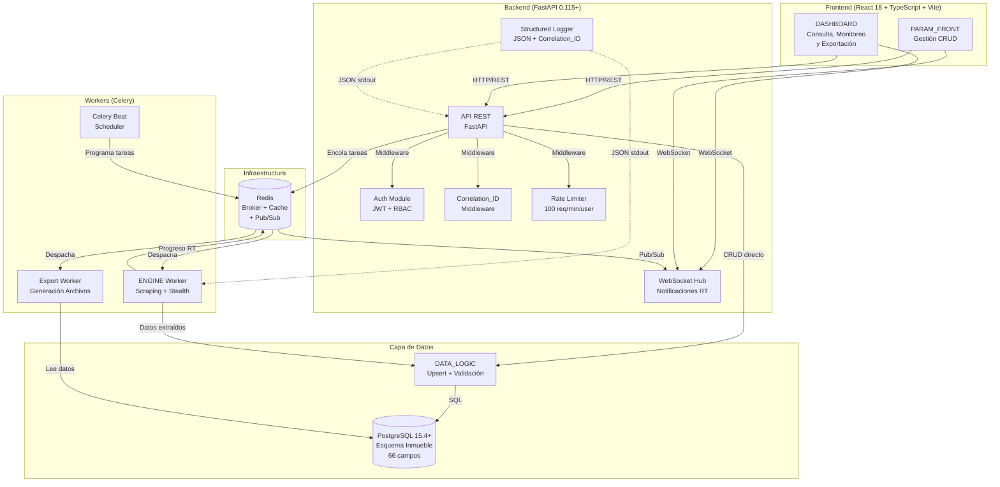
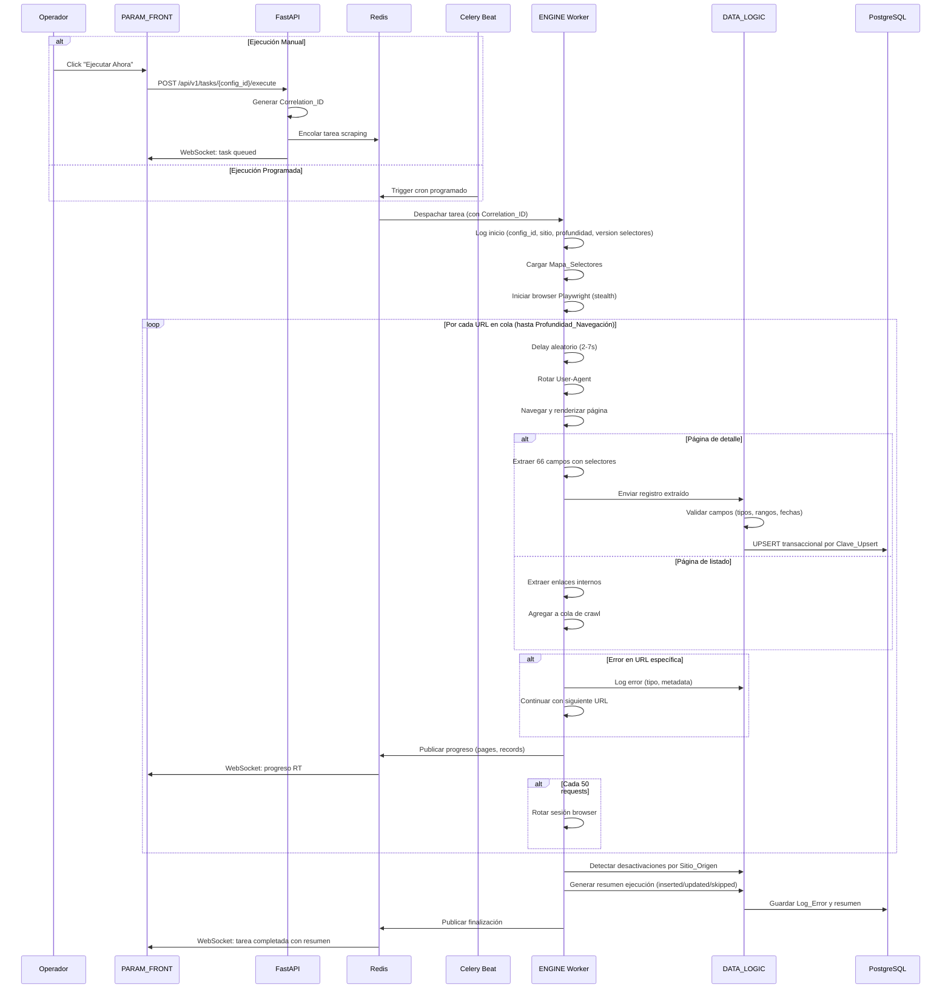

# Documento de Diseño — Plataforma Paramétrica de Web Scraping Inmobiliario

## Resumen

Este documento describe el diseño técnico de la plataforma paramétrica de web scraping para el mercado inmobiliario latinoamericano. El sistema se compone de cuatro módulos principales: PARAM_FRONT (gestión CRUD de configuraciones), ENGINE (motor de scraping con capacidades stealth), DATA_LOGIC (lógica de persistencia, upsert y registro de errores) y DASHBOARD (consulta, monitoreo de ejecuciones y exportación de datos). Capas transversales de observabilidad (Correlation_ID, structured logging) y seguridad (JWT + RBAC, rate limiting) garantizan trazabilidad y protección en todas las operaciones.

La arquitectura sigue un patrón de microservicios ligeros con una API REST central, WebSocket para notificaciones en tiempo real, una cola de tareas para ejecución asíncrona y una base de datos PostgreSQL como almacén principal.

### Decisiones Técnicas Clave

| Decisión | Elección | Justificación |
|---|---|---|
| Lenguaje backend | Python 3.12+ | Ecosistema maduro para scraping (Playwright, BeautifulSoup). FastAPI ofrece alto rendimiento con tipado estático. |
| Framework API | FastAPI 0.115+ | Async nativo, validación automática con Pydantic, documentación OpenAPI generada, soporte WebSocket nativo. |
| Base de datos | PostgreSQL 15.4+ | Soporte robusto para UPSERT nativo (`ON CONFLICT`), índices parciales, JSONB para flexibilidad, y excelente rendimiento con esquemas anchos (66 columnas). |
| Automatización browser | Playwright (Python) | Más moderno que Selenium, mejor soporte stealth, API async nativa, múltiples contextos de navegador eficientes. |
| Cola de tareas | Celery + Redis | Celery soporta cron nativo (Celery Beat), reintentos, y monitoreo. Redis como broker es ligero y rápido. |
| Frontend | React 18 + TypeScript + Vite 5.x | Ecosistema amplio, componentes reutilizables para PARAM_FRONT y DASHBOARD. |
| ORM | SQLAlchemy 2.0+ (async) con asyncpg | Soporte async nativo, migraciones con Alembic, mapeo directo al esquema de 66 campos. |
| Exportación | Pandas + openpyxl | Generación eficiente de CSV, Excel y JSON para exportaciones masivas. |
| WebSocket | FastAPI WebSocket + Redis Pub/Sub | Notificaciones en tiempo real de progreso de tareas a clientes conectados. |
| Rate Limiting | slowapi (basado en limits) | Rate limiting por usuario autenticado, integración nativa con FastAPI. |
| Logging | structlog + python-json-logger | Structured JSON logging con Correlation_ID propagado entre capas. |
| Auth | PyJWT + bcrypt + httpOnly cookies | JWT access token (30min) + refresh token en httpOnly cookie. Passwords hasheados con bcrypt. |
| Validación frontend | Zod 3.x + React Hook Form 7.x | Validación de esquemas TypeScript-first con manejo eficiente de formularios. |
| UI Components | Shadcn UI + Tailwind CSS 3.x | Componentes accesibles y personalizables con estilizado basado en utilidades. |

## Arquitectura

### Diagrama de Arquitectura General



### Flujo de Ejecución de Scraping



### Principios Arquitectónicos

1. **Desacoplamiento por colas**: El ENGINE se ejecuta como worker Celery independiente, permitiendo escalar horizontalmente sin afectar la API.
2. **Persistencia transaccional**: Cada operación de upsert se ejecuta dentro de una transacción PostgreSQL para garantizar consistencia.
3. **Fail-safe**: Los errores en el ENGINE no detienen la ejecución completa; se registran y se continúa con la siguiente URL (Req 3.7).
4. **Configuración dinámica**: Los Mapas de Selectores se cargan al inicio de cada tarea, permitiendo cambios sin reiniciar el sistema.
5. **Trazabilidad end-to-end**: Cada petición genera un Correlation_ID que se propaga a través de API, workers y base de datos (Req 14.1).
6. **Observabilidad estructurada**: Todos los logs se emiten en formato JSON con campos estandarizados (Req 14.2).
7. **Protección por rate limiting**: Todos los endpoints API están protegidos con límite de 100 req/min por usuario autenticado (Req 14.4).


## Componentes e Interfaces

### Módulo PARAM_FRONT (Frontend)

**Responsabilidad**: Interfaz CRUD para gestión de configuraciones de scraping y mapas de selectores. Recibe notificaciones WebSocket de cambios de estado de tareas.

**Componentes React principales**:
- `ConfigList`: Tabla paginada de configuraciones con acciones (editar, eliminar, ejecutar), mostrando fecha de última ejecución.
- `ConfigForm`: Formulario de creación/edición con validación client-side (Zod + React Hook Form).
- `CronScheduleInput`: Selector visual de expresiones cron con preview legible del schedule (Req 1.4).
- `SelectorMapEditor`: Editor visual de mapas de selectores CSS por Sitio_Origen con versionado.
- `WebSocketProvider`: Context provider que gestiona la conexión WebSocket y distribuye eventos a componentes suscritos.

**Interfaz API consumida**:

```
GET    /api/v1/configs                    → Lista configuraciones (paginada, con fecha última ejecución)
POST   /api/v1/configs                    → Crear configuración
GET    /api/v1/configs/{id}               → Detalle configuración
PUT    /api/v1/configs/{id}               → Actualizar configuración
DELETE /api/v1/configs/{id}               → Soft-delete configuración
GET    /api/v1/selector-maps/{sitio}      → Obtener mapa selectores
PUT    /api/v1/selector-maps/{sitio}      → Actualizar mapa selectores
POST   /api/v1/tasks/{config_id}/execute  → Ejecutar scraping manual
WS     /api/v1/ws/tasks                   → WebSocket para notificaciones de tareas en tiempo real
```

### Módulo ENGINE (Celery Worker)

**Responsabilidad**: Ejecución del scraping con navegación recursiva, stealth y extracción de datos. Publica progreso en tiempo real vía Redis Pub/Sub. Propaga Correlation_ID en todos los logs.

**Componentes internos**:

```python
class ScrapingEngine:
    """Orquestador principal del proceso de scraping."""
    
    async def execute(self, config: ConfiguracionScraping, correlation_id: str) -> ExecutionSummary:
        """Ejecuta una tarea de scraping completa. Propaga correlation_id en logs."""
        ...
    
    async def _publish_progress(self, task_id: str, pages: int, records: int) -> None:
        """Publica progreso en tiempo real vía Redis Pub/Sub."""
        ...

class BrowserManager:
    """Gestión del ciclo de vida del browser Playwright con stealth."""
    
    async def new_context(self) -> BrowserContext:
        """Crea un nuevo contexto con configuración anti-detección."""
        ...
    
    async def rotate_session(self) -> None:
        """Rota la sesión cada 50 requests."""
        ...

class CrawlQueue:
    """Cola de URLs a procesar con control de profundidad y deduplicación."""
    
    def add(self, url: str, depth: int) -> bool:
        """Agrega URL si no fue visitada y no excede profundidad."""
        ...
    
    def next(self) -> Optional[CrawlItem]:
        """Retorna siguiente URL a procesar."""
        ...

class DataExtractor:
    """Extracción de datos usando Mapa_Selectores."""
    
    def extract(self, page: Page, selector_map: MapaSelectores) -> Dict[str, Any]:
        """Extrae los 66 campos de una página de detalle."""
        ...

class StealthConfig:
    """Configuración de técnicas anti-bot."""
    
    user_agents: List[str]  # Pool de 20+ User-Agents
    min_delay: float = 2.0
    max_delay: float = 7.0
    session_rotation_interval: int = 50
    backoff_initial: int = 30
    backoff_max: int = 600
```

### Módulo DATA_LOGIC (Capa de Datos)

**Responsabilidad**: Validación, upsert transaccional, serialización, registro de errores y detección de desactivaciones. Calcula explícitamente Cambio_Precio_Valor en actualizaciones de precio.

**Componentes internos**:

```python
class UpsertService:
    """Lógica de upsert por Clave_Upsert (Código_Inmueble + Sitio_Origen)."""
    
    async def upsert(self, record: EsquemaInmueble) -> UpsertResult:
        """Inserta (con Estado_Activo=true) o actualiza un registro inmobiliario.
        Ejecuta dentro de transacción PostgreSQL.
        Calcula Cambio_Precio_Valor = nuevo_precio - precio_anterior en updates."""
        ...

class FieldValidator:
    """Validación y normalización de los 66 campos según Diccionario de Datos."""
    
    NUMERIC_FIELDS = [
        "Habitaciones", "Baños", "Estacionamiento", "Administracion_Valor",
        "Metros_Utiles", "Metros_Totales", "Latitud", "Longitud", "Estrato",
        "Precio_USD", "Precio_Local", "Piso_Propiedad", "Cambio_Precio_Valor",
        "Area_Privada", "Area_Construida"
    ]
    
    BOOLEAN_FIELDS = [
        "Tipo_Estudio", "Es_Loft", "Tiene_Ascensores", "Tiene_Balcones",
        "Tiene_Seguridad", "Tiene_Bodega_Deposito", "Tiene_Terraza",
        "Cuarto_Servicio", "Baño_Servicio", "Tiene_Calefaccion", "Tiene_Alarma",
        "Acceso_Controlado", "Circuito_Cerrado", "Estacionamiento_Visita",
        "Cocina_Americana", "Tiene_Gimnasio", "Tiene_BBQ", "Tiene_Piscina",
        "En_Conjunto_Residencial", "Uso_Comercial", "Precio_Bajo"
    ]
    
    DATE_FIELDS = [
        "Fecha_Control", "Fecha_Actualizacion", "Fecha_Publicacion", "Fecha_Desactivacion"
    ]
    
    def validate(self, raw_data: Dict[str, Any]) -> ValidationResult:
        """Valida tipos, rangos y formatos de todos los campos."""
        ...
    
    def parse_numeric(self, value: str) -> Optional[float]:
        """Intenta extraer valor numérico de una cadena."""
        ...
    
    def parse_boolean(self, value: str) -> Optional[bool]:
        """Interpreta valores como booleanos (Si/No, True/False, 1/0)."""
        ...
    
    def parse_date(self, value: str) -> Optional[datetime]:
        """Parsea valor a fecha válida, retorna None si falla."""
        ...

class Serializer:
    """Serialización/deserialización de registros inmobiliarios."""
    
    def to_json(self, record: EsquemaInmueble) -> str:
        """Serializa un registro a JSON preservando los 66 campos incluyendo nulls."""
        ...
    
    def from_json(self, json_str: str) -> EsquemaInmueble:
        """Deserializa un JSON a registro inmobiliario con tipos restaurados."""
        ...

class ErrorLogger:
    """Registro estructurado de errores de scraping."""
    
    ERROR_TYPES = ["Timeout", "CAPTCHA", "Estructura", "Conexión"]
    
    async def log(self, error: ScrapingError, correlation_id: str) -> None:
        """Persiste un error clasificado en la tabla de errores con Correlation_ID."""
        ...
    
    async def generate_summary(self, task_id: str) -> ExecutionSummary:
        """Genera resumen con: pages_processed, records_extracted, records_inserted,
        records_updated, records_skipped, errors_by_type, duration_seconds."""
        ...

class DeactivationDetector:
    """Detección de inmuebles desactivados por Sitio_Origen."""
    
    async def detect(self, sitio_origen: str, found_keys: Set[str]) -> int:
        """Marca como inactivos (Estado_Activo=false, Fecha_Desactivacion=now)
        los registros del sitio_origen no encontrados en found_keys.
        Reactiva registros previamente desactivados si reaparecen."""
        ...
```

### Módulo DASHBOARD (Frontend)

**Responsabilidad**: Consulta, visualización, monitoreo de ejecuciones en tiempo real y exportación de datos inmobiliarios.

**Componentes React principales**:
- `FilterPanel`: Panel de filtros combinables (Sitio_Origen, Tipo_Inmueble, Operación, Municipio, Sector, Barrio, Estrato, rango Precio_Local, rango Metros_Totales, Estado_Activo, rango Fecha_Control).
- `DataTable`: Tabla paginada con columnas configurables de los 66 campos.
- `RecordDetail`: Vista detalle de un inmueble con todos los campos.
- `ExportDialog`: Selector de formato (CSV, Excel, JSON) con progreso async.
- `SummaryPanel`: Panel resumen con totales por Sitio_Origen y Operación.
- `ErrorLogViewer`: Visor de errores con filtros por tipo, Sitio_Origen, Tarea_Scraping y rango de fecha (Req 10.6).
- `TaskMonitorList`: Lista paginada de ejecuciones con filtros por status, configuración, fecha y Sitio_Origen (Req 13.1, 13.4).
- `TaskMonitorDetail`: Vista detalle de ejecución con conteos (inserted/updated/skipped) y errores agrupados por tipo (Req 13.2).
- `TaskProgressBar`: Indicador de progreso en tiempo real vía WebSocket con conteo de páginas y registros (Req 13.3).

**Interfaz API consumida**:

```
GET    /api/v1/properties                 → Buscar inmuebles (filtros + paginación)
GET    /api/v1/properties/{id}            → Detalle inmueble (66 campos)
POST   /api/v1/exports                    → Solicitar exportación
GET    /api/v1/exports/{id}/status        → Estado de exportación
GET    /api/v1/exports/{id}/download      → Descargar archivo
GET    /api/v1/summary                    → Resumen general
GET    /api/v1/errors                     → Listar errores (filtros + paginación)
GET    /api/v1/tasks                      → Listar ejecuciones (filtros: status, config, fecha, sitio)
GET    /api/v1/tasks/{id}                 → Detalle ejecución con resumen completo
WS     /api/v1/ws/tasks                   → WebSocket para progreso en tiempo real
```

### Módulo AUTH

**Responsabilidad**: Autenticación JWT con refresh token en httpOnly cookie y control de acceso basado en roles.

```python
class AuthService:
    """Autenticación y autorización."""
    
    ACCESS_TOKEN_EXPIRE_MINUTES = 30
    
    async def login(self, username: str, password: str) -> TokenPair:
        """Autentica usuario con bcrypt, retorna JWT access token (30min)
        y refresh token en httpOnly cookie."""
        ...
    
    async def refresh(self, refresh_token: str) -> AccessToken:
        """Renueva access token usando refresh token sin re-autenticación."""
        ...
    
    async def verify_token(self, token: str) -> UserClaims:
        """Verifica y decodifica un JWT token."""
        ...
    
    async def check_session_activity(self, user_id: int) -> bool:
        """Invalida sesión si inactiva > 30 minutos."""
        ...

class RBACMiddleware:
    """Middleware de control de acceso por roles."""
    
    ROLE_PERMISSIONS = {
        "administrador": [
            "configs:read", "configs:write", 
            "dashboard:read", "dashboard:export", 
            "tasks:execute", "tasks:read",
            "users:manage"
        ],
        "operador": [
            "configs:read", 
            "dashboard:read", "dashboard:export",
            "tasks:read"
        ],
    }
```

### Módulo Observabilidad (Transversal — Req 14)

**Responsabilidad**: Trazabilidad end-to-end y logging estructurado en todas las capas.

```python
class CorrelationIDMiddleware:
    """Middleware FastAPI que genera y propaga Correlation_ID."""
    
    HEADER_NAME = "X-Correlation-ID"
    
    async def __call__(self, request: Request, call_next):
        """Genera UUID como Correlation_ID si no viene en headers.
        Lo inyecta en el contexto de la request y en headers de respuesta.
        Se propaga a Celery tasks vía task headers."""
        ...

class StructuredLogger:
    """Logger JSON estructurado con campos estandarizados."""
    
    def log(self, level: str, message: str, **kwargs) -> None:
        """Emite log JSON con: timestamp, level, service, correlation_id, message.
        Campos adicionales se incluyen como kwargs."""
        ...

class RateLimitMiddleware:
    """Rate limiting por usuario autenticado usando slowapi."""
    
    RATE_LIMIT = "100/minute"
    
    async def __call__(self, request: Request, call_next):
        """Aplica límite de 100 req/min por usuario.
        Retorna HTTP 429 con header Retry-After cuando se excede."""
        ...
```

### API REST — Diseño Detallado

Todos los endpoints usan prefijo `/api/v1/` para versionamiento. Todos propagan Correlation_ID y están protegidos por rate limiting (100 req/min/user).

#### Autenticación

```
POST /api/v1/auth/login
  Body: { "username": str, "password": str }
  Response 200: { "access_token": str, "expires_in": 1800 }
  Set-Cookie: refresh_token=<token>; HttpOnly; Secure; SameSite=Strict
  Response 401: { "detail": "Credenciales inválidas" }

POST /api/v1/auth/refresh
  Cookie: refresh_token=<token>
  Response 200: { "access_token": str, "expires_in": 1800 }
  Response 401: { "detail": "Refresh token inválido o expirado" }

POST /api/v1/auth/logout
  Response 200: { "detail": "Sesión cerrada" }
  Set-Cookie: refresh_token=; HttpOnly; Secure; Max-Age=0
```

#### Configuraciones de Scraping

```
GET /api/v1/configs?page=1&size=20&active=true
  Response 200: { 
    "items": [{ ...config, "last_execution_at": datetime | null }], 
    "total": int, "page": int, "pages": int 
  }

POST /api/v1/configs
  Body: {
    "url_base": str,
    "profundidad_navegacion": int,
    "tipo_operacion": "Venta" | "Arriendo",
    "modo_ejecucion": "Manual" | "Programado",
    "cron_expression": str | null
  }
  Response 201: { "id": int, ...config }
  Response 422: { "detail": [{ "field": str, "message": str }] }

PUT /api/v1/configs/{id}
  Body: (mismos campos que POST, todos opcionales)
  Response 200: { ...config actualizada }

DELETE /api/v1/configs/{id}
  Response 200: { "id": int, "active": false }
```

#### Mapas de Selectores

```
GET /api/v1/selector-maps/{sitio_origen}
  Response 200: {
    "sitio_origen": str, "version": int,
    "mappings": { "Tipo_Inmueble": ["div.property-type", "span.type"], ... }
  }

PUT /api/v1/selector-maps/{sitio_origen}
  Body: { "mappings": { campo: [selectores_css] } }
  Response 200: { ...mapa actualizado con nueva versión }
```

#### Ejecución de Tareas

```
POST /api/v1/tasks/{config_id}/execute
  Response 202: { "task_id": str, "status": "queued", "correlation_id": str }
  Response 409: { "detail": "Ya existe una tarea en ejecución para esta configuración" }

GET /api/v1/tasks?page=1&size=20&status=success&config_id=1&sitio_origen=X&date_from=...&date_to=...
  Response 200: { "items": [...], "total": int, "page": int, "pages": int }

GET /api/v1/tasks/{task_id}
  Response 200: {
    "task_id": str, "config_id": int, "config_name": str,
    "status": str, "started_at": datetime, "ended_at": datetime | null,
    "duration_seconds": float | null, "pages_processed": int,
    "records_extracted": int, "records_inserted": int,
    "records_updated": int, "records_skipped": int,
    "errors_by_type": { "Timeout": int, "CAPTCHA": int, "Estructura": int, "Conexión": int },
    "correlation_id": str
  }
```

#### Propiedades Inmobiliarias

```
GET /api/v1/properties?sitio_origen=X&tipo_inmueble=Y&operacion=Venta&precio_min=100000&precio_max=500000&estado_activo=true&fecha_control_from=...&fecha_control_to=...&page=1&size=50
  Response 200: { "items": [...], "total": int, "page": int, "pages": int }

GET /api/v1/properties/{id}
  Response 200: { ...66 campos del Esquema_Inmueble }
```

#### Errores

```
GET /api/v1/errors?error_type=Timeout&sitio_origen=X&task_id=Y&date_from=...&date_to=...&page=1&size=50
  Response 200: { "items": [...], "total": int, "page": int, "pages": int }
```

#### Exportaciones

```
POST /api/v1/exports
  Body: { "format": "csv" | "excel" | "json", "filters": { ...mismos filtros que GET /properties } }
  Response 202: { "export_id": str, "status": "processing" }

GET /api/v1/exports/{id}/status
  Response 200: { "export_id": str, "status": "processing" | "ready" | "failed", "record_count": int }

GET /api/v1/exports/{id}/download
  Response 200: (archivo binario con Content-Disposition)
```

#### WebSocket — Notificaciones en Tiempo Real

```
WS /api/v1/ws/tasks?token={jwt_access_token}
  
  Mensajes del servidor:
  { "type": "task_status", "task_id": str, "status": str, "summary": {...} }
  { "type": "task_progress", "task_id": str, "pages_processed": int, "records_extracted": int }
  { "type": "export_ready", "export_id": str }
```


## Modelos de Datos

### Diagrama Entidad-Relación

```mermaid
erDiagram
    USUARIO {
        int id PK
        varchar username UK
        varchar password_hash
        varchar role
        timestamp created_at
        timestamp last_login
        boolean active
    }

    CONFIGURACION_SCRAPING {
        int id PK
        varchar url_base
        int profundidad_navegacion
        varchar tipo_operacion
        varchar modo_ejecucion
        varchar cron_expression
        boolean active
        timestamp created_at
        timestamp updated_at
        timestamp last_execution_at
    }

    MAPA_SELECTORES {
        int id PK
        varchar sitio_origen
        int version
        jsonb mappings
        timestamp created_at
    }

    TAREA_SCRAPING {
        uuid task_id PK
        int config_id FK
        varchar status
        varchar correlation_id
        timestamp started_at
        timestamp ended_at
        float duration_seconds
        int pages_processed
        int records_extracted
        int records_inserted
        int records_updated
        int records_skipped
        jsonb errors_by_type
    }

    ESQUEMA_INMUEBLE {
        bigint id_interno PK
        varchar codigo_inmueble
        varchar sitio_origen
        varchar tipo_inmueble
        int habitaciones
        int banos
        varchar operacion
        int estacionamiento
        decimal administracion_valor
        varchar antiguedad_detalle
        varchar rango_antiguedad
        boolean tipo_estudio
        boolean es_loft
        varchar dueno_anuncio
        varchar telefono_principal
        varchar telefono_opcional
        varchar correo_contacto
        varchar tipo_publicador
        text descripcion_anuncio
        timestamp fecha_control
        timestamp fecha_actualizacion
        varchar municipio
        boolean amoblado
        varchar titulo_anuncio
        decimal metros_utiles
        decimal metros_totales
        varchar orientacion
        decimal latitud
        decimal longitud
        varchar url_anuncio
        varchar url_imagen_principal
        varchar sector
        varchar barrio
        int estrato
        timestamp fecha_publicacion
        varchar direccion
        boolean estado_activo
        timestamp fecha_desactivacion
        decimal precio_usd
        decimal precio_local
        varchar simbolo_moneda
        int piso_propiedad
        boolean tiene_ascensores
        boolean tiene_balcones
        boolean tiene_seguridad
        boolean tiene_bodega_deposito
        boolean tiene_terraza
        boolean cuarto_servicio
        boolean bano_servicio
        boolean tiene_calefaccion
        boolean tiene_alarma
        boolean acceso_controlado
        boolean circuito_cerrado
        boolean estacionamiento_visita
        boolean cocina_americana
        boolean tiene_gimnasio
        boolean tiene_bbq
        boolean tiene_piscina
        boolean en_conjunto_residencial
        boolean uso_comercial
        decimal cambio_precio_valor
        boolean precio_bajo
        varchar tipo_empresa
        varchar glosa_administracion
        decimal area_privada
        decimal area_construida
    }

    LOG_ERROR {
        bigint id PK
        uuid task_id FK
        varchar sitio_origen
        varchar url
        varchar error_type
        text error_message
        jsonb error_metadata
        varchar correlation_id
        timestamp created_at
    }

    EXPORTACION {
        uuid export_id PK
        int user_id FK
        varchar format
        jsonb filters
        varchar status
        int record_count
        varchar file_path
        timestamp created_at
        timestamp completed_at
    }

    USUARIO ||--o{ EXPORTACION : "solicita"
    CONFIGURACION_SCRAPING ||--o{ TAREA_SCRAPING : "genera"
    TAREA_SCRAPING ||--o{ LOG_ERROR : "registra"
    MAPA_SELECTORES }o--|| CONFIGURACION_SCRAPING : "asociado via sitio_origen"
    TAREA_SCRAPING ||--o{ ESQUEMA_INMUEBLE : "extrae"
    ESQUEMA_INMUEBLE }o--|| MAPA_SELECTORES : "usa selectores de"
```



**Cambios respecto a versión anterior del ER**:
- `CONFIGURACION_SCRAPING`: Agregado campo `last_execution_at` (Req 1.5).
- `TAREA_SCRAPING`: Agregados campos `correlation_id` (Req 14.1), `records_inserted`, `records_updated`, `records_skipped` (Req 2.5).
- `ESQUEMA_INMUEBLE`: Campos `Tipo_Estudio` y `Es_Loft` cambiados a `boolean` según Diccionario de Datos (Req 8.4). Campo `Fecha_Publicacion` cambiado a `timestamp` (Req 8.5).
- `LOG_ERROR`: Agregado campo `correlation_id` (Req 14.1).

### Índices y Restricciones Clave

```sql
-- Clave Upsert: restricción única compuesta
ALTER TABLE esquema_inmueble 
  ADD CONSTRAINT uq_clave_upsert UNIQUE (codigo_inmueble, sitio_origen);

-- Índices para consultas frecuentes del DASHBOARD
CREATE INDEX idx_inmueble_sitio_origen ON esquema_inmueble(sitio_origen);
CREATE INDEX idx_inmueble_operacion ON esquema_inmueble(operacion);
CREATE INDEX idx_inmueble_tipo ON esquema_inmueble(tipo_inmueble);
CREATE INDEX idx_inmueble_municipio ON esquema_inmueble(municipio);
CREATE INDEX idx_inmueble_precio_local ON esquema_inmueble(precio_local);
CREATE INDEX idx_inmueble_estado_activo ON esquema_inmueble(estado_activo);
CREATE INDEX idx_inmueble_fecha_control ON esquema_inmueble(fecha_control);

-- Índice parcial para inmuebles activos (optimiza consultas más comunes)
CREATE INDEX idx_inmueble_activos ON esquema_inmueble(sitio_origen, operacion) 
  WHERE estado_activo = true;

-- Índices para Log_Error (incluye filtros Req 10.6)
CREATE INDEX idx_error_task ON log_error(task_id);
CREATE INDEX idx_error_type ON log_error(error_type);
CREATE INDEX idx_error_sitio ON log_error(sitio_origen);
CREATE INDEX idx_error_created ON log_error(created_at);
CREATE INDEX idx_error_correlation ON log_error(correlation_id);

-- Índices para Tarea_Scraping (filtros Req 13.4)
CREATE INDEX idx_tarea_status ON tarea_scraping(status);
CREATE INDEX idx_tarea_config ON tarea_scraping(config_id);
CREATE INDEX idx_tarea_started ON tarea_scraping(started_at);
CREATE INDEX idx_tarea_correlation ON tarea_scraping(correlation_id);

-- Índice para versionado de mapas de selectores
CREATE INDEX idx_mapa_sitio_version ON mapa_selectores(sitio_origen, version DESC);
```

### Estrategia Anti-Bot — Diseño Detallado

El ENGINE implementa múltiples capas de evasión anti-bot:

**Capa 1: Identidad del Navegador**
- Pool de 20+ User-Agent strings actualizados (Chrome, Firefox, Safari en Windows, macOS, Linux).
- Rotación aleatoria por request.
- Configuración de `navigator.webdriver = false` via Playwright stealth.
- Viewport realista aleatorio (1280x720, 1366x768, 1920x1080).
- Emulación de plugins estándar (PDF viewer, Chrome PDF).

**Capa 2: Comportamiento Temporal**
- Delay aleatorio entre 2-7 segundos entre requests (distribución uniforme).
- Jitter adicional de ±500ms para evitar patrones detectables.
- Backoff exponencial ante HTTP 429: 30s → 60s → 120s → 240s → 480s → 600s (máximo).

**Capa 3: Gestión de Sesiones**
- Rotación de contexto de navegador cada 50 requests.
- Limpieza de cookies y localStorage en cada rotación.
- Nuevo fingerprint de navegador en cada contexto.

**Capa 4: Manejo de CAPTCHA**
- Detección heurística de CAPTCHAs (presencia de iframes de reCAPTCHA, hCaptcha, elementos con clase/id "captcha").
- Log del evento como error tipo CAPTCHA con Correlation_ID.
- Skip de la página y continuación con la siguiente URL.
- No se implementa resolución automática de CAPTCHAs (decisión ética y de ToS).


## Correctness Properties

*A property is a characteristic or behavior that should hold true across all valid executions of a system — essentially, a formal statement about what the system should do. Properties serve as the bridge between human-readable specifications and machine-verifiable correctness guarantees.*

### Property 1: URL Validation Correctness

*For any* string input, the URL validator SHALL accept only well-formed HTTP or HTTPS URLs and reject all other strings. This applies to both Configuración_Scraping URL base fields and Esquema_Inmueble URL fields (Url_Anuncio, Url_Imagen_Principal).

**Validates: Requirements 1.2, 8.7**

### Property 2: Profundidad_Navegación Range Validation

*For any* numeric input, the depth validator SHALL accept only integers in the range [1, 10] and reject all other values (floats, negatives, zero, values > 10).

**Validates: Requirements 1.3**

### Property 3: Cron Expression Validation and Preview

*For any* string input, the cron validator SHALL accept only syntactically valid cron expressions and produce a non-empty human-readable preview string for each valid expression.

**Validates: Requirements 1.4**

### Property 4: Soft Delete Preserves Record

*For any* valid Configuración_Scraping, performing a soft delete SHALL set `active=false` while the record remains queryable in the database.

**Validates: Requirements 1.7**

### Property 5: Concurrent Execution Guard

*For any* Configuración_Scraping that has a Tarea_Scraping with status `running`, attempting to enqueue a new execution SHALL be rejected and a warning SHALL be logged.

**Validates: Requirements 2.4**

### Property 6: Crawl Queue Depth and Deduplication

*For any* set of URLs discovered during crawling, the CrawlQueue SHALL (a) never enqueue a URL at a depth exceeding the configured Profundidad_Navegación, and (b) never enqueue a URL that has already been visited in the current execution.

**Validates: Requirements 3.2, 3.3, 3.6**

### Property 7: Extraction Produces Complete 66-Field Records

*For any* page and valid Mapa_Selectores, the DataExtractor SHALL produce a dictionary with exactly 66 keys matching the Esquema_Inmueble fields, where fields not found on the page are set to `null` rather than omitted.

**Validates: Requirements 3.4, 3.5, 8.1**

### Property 8: Fail-Safe Continuation on Error

*For any* crawl queue containing URLs where some produce unrecoverable errors, the ENGINE SHALL process all non-failing URLs, log errors for failing ones, and never halt the entire execution due to a single URL failure.

**Validates: Requirements 3.7**

### Property 9: CSS Selector Syntax Validation

*For any* string input, the CSS selector validator SHALL accept only syntactically valid CSS selectors and reject invalid ones.

**Validates: Requirements 4.2**

### Property 10: Selector Priority Order

*For any* field with multiple configured CSS selectors, the ENGINE SHALL use the value from the first selector that returns a non-empty match, ignoring subsequent selectors.

**Validates: Requirements 4.3**

### Property 11: Selector Map Versioning

*For any* update to a Mapa_Selectores, the new version number SHALL equal the previous version + 1, and the previous version SHALL remain queryable.

**Validates: Requirements 4.5**

### Property 12: Stealth Delay Range

*For any* generated inter-request delay, the value SHALL fall within the range [2.0, 7.0] seconds.

**Validates: Requirements 5.2**

### Property 13: Exponential Backoff Calculation

*For any* sequence of N consecutive HTTP 429 responses (N >= 1), the backoff delay SHALL equal `min(30 * 2^(N-1), 600)` seconds.

**Validates: Requirements 5.5**

### Property 14: Upsert Behavior — Insert, Update, and Skip

*For any* valid Esquema_Inmueble record: (a) if the Clave_Upsert does not exist, the record SHALL be inserted with `Estado_Activo=true` and `Fecha_Control=now`; (b) if the Clave_Upsert exists and at least one field differs, the record SHALL be updated with `Fecha_Actualizacion=now`; (c) if the Clave_Upsert exists and no fields differ, the record SHALL remain unchanged (idempotence).

**Validates: Requirements 6.1, 6.2, 6.3, 6.4**

### Property 15: Price Change Calculation

*For any* upsert update where Precio_Local changes, `Cambio_Precio_Valor` SHALL equal `new_Precio_Local - old_Precio_Local`, and `Precio_Bajo` SHALL be `true` if the new price is lower than the previous price, `false` otherwise.

**Validates: Requirements 6.5**

### Property 16: Upsert Round-Trip

*For any* valid Esquema_Inmueble record, inserting via upsert and then querying by its Clave_Upsert (Codigo_Inmueble + Sitio_Origen) SHALL return a record equivalent to the original.

**Validates: Requirements 6.8**

### Property 17: Field Type Parsing

*For any* string value in a numeric field, `parse_numeric` SHALL extract the numeric portion or return `None`. *For any* string value in a boolean field, `parse_boolean` SHALL return `true`/`false` for recognized values or `None` for unrecognizable values. *For any* string value in a date field, `parse_date` SHALL return a valid datetime or `None`. *For any* Latitud value, it SHALL be validated in range [-90, 90]; *for any* Longitud value, in range [-180, 180].

**Validates: Requirements 8.3, 8.4, 8.5, 8.6**

### Property 18: Serialization Round-Trip

*For any* valid Esquema_Inmueble record, serializing to JSON and then deserializing SHALL produce a record equivalent to the original, preserving all 66 fields including null values with correct types restored.

**Validates: Requirements 9.1, 9.2, 9.3**

### Property 19: Deserialization Robustness

*For any* valid JSON string with extra fields not in the Esquema_Inmueble, deserialization SHALL succeed ignoring the extra fields. *For any* JSON string missing required fields (Codigo_Inmueble, Sitio_Origen), deserialization SHALL return a descriptive error indicating the missing fields.

**Validates: Requirements 9.4, 9.5**

### Property 20: Deactivation and Reactivation by Sitio_Origen

*For any* Sitio_Origen and set of extracted Clave_Upsert keys: (a) active records whose keys are NOT in the extracted set SHALL be deactivated (`Estado_Activo=false`, `Fecha_Desactivacion=now`); (b) previously deactivated records whose keys ARE in the extracted set SHALL be reactivated (`Estado_Activo=true`, `Fecha_Desactivacion=null`); (c) records belonging to OTHER Sitio_Origen values SHALL remain unchanged.

**Validates: Requirements 11.1, 11.2, 11.3**

### Property 21: RBAC Permission Enforcement

*For any* user with a given role and any API endpoint, access SHALL be granted if and only if the role's permissions include the required permission for that endpoint.

**Validates: Requirements 12.4**

### Property 22: Correlation_ID Propagation

*For any* API request, the system SHALL generate a unique Correlation_ID and propagate it through the response headers, associated Tarea_Scraping records, Log_Error records, and all structured log entries for that request chain.

**Validates: Requirements 14.1**

### Property 23: Structured Log Format

*For any* log entry emitted by the system, the JSON output SHALL contain the fields: `timestamp`, `level`, `service`, `correlation_id`, and `message`.

**Validates: Requirements 14.2**

## Error Handling

### Estrategia General

El sistema implementa manejo de errores en múltiples capas con el principio de **fail-safe**: los errores individuales no deben detener el flujo completo de ejecución.

### Errores del ENGINE (Scraping)

| Tipo de Error | Clasificación | Comportamiento | Metadata Registrada |
|---|---|---|---|
| Request timeout | `Timeout` | Log error, skip URL, continuar | timeout_threshold, elapsed_time |
| CAPTCHA detectado | `CAPTCHA` | Log error, skip URL, continuar | url, page_title |
| Estructura HTML cambiada | `Estructura` | Log warning, campo=null, continuar | field_name, expected_selector, sitio_origen |
| Fallo de conexión de red | `Conexión` | Log error, skip URL, continuar | url, connection_error_details |
| HTTP 429 | Retry | Backoff exponencial (30s-600s) | retry_count, delay_seconds |
| Error no clasificado | `Estructura` | Log error, skip URL, continuar | raw_error_message |

### Errores de DATA_LOGIC (Persistencia)

| Tipo de Error | Comportamiento |
|---|---|
| Violación de constraint único | Retry como UPDATE (ON CONFLICT) |
| Error de transacción | Rollback, log error, continuar con siguiente registro |
| Fallo de parsing numérico | Campo=null, log warning con valor original |
| Fallo de parsing booleano | Campo=null, log warning con valor original |
| Fallo de parsing fecha | Campo=null, log warning con valor original |
| Lat/Lon fuera de rango | Campo=null, log warning |
| URL malformada | Campo=null, log warning |
| JSON con campos extra | Ignorar extras, log warning |
| JSON sin campos requeridos | Retornar error descriptivo, no procesar |

### Errores de API (FastAPI)

| Tipo de Error | HTTP Status | Comportamiento |
|---|---|---|
| Validación de input | 422 | Retornar detalle de campos inválidos |
| Autenticación fallida | 401 | Mensaje genérico sin revelar causa |
| Autorización insuficiente | 403 | Indicar permiso requerido |
| Recurso no encontrado | 404 | Mensaje descriptivo |
| Tarea ya en ejecución | 409 | Indicar conflicto |
| Rate limit excedido | 429 | Header Retry-After con segundos restantes |
| Error interno | 500 | Log completo con Correlation_ID, respuesta genérica al cliente |

### Errores de WebSocket

| Tipo de Error | Comportamiento |
|---|---|
| Token JWT inválido/expirado | Cerrar conexión con código 4001 |
| Desconexión del cliente | Limpiar suscripción, no afecta backend |
| Error en Redis Pub/Sub | Reconexión automática con backoff |

## Testing Strategy

### Enfoque Dual: Unit Tests + Property-Based Tests

La estrategia de testing combina dos enfoques complementarios:

- **Unit tests (pytest + Vitest)**: Verifican ejemplos específicos, edge cases, integraciones y escenarios de error concretos.
- **Property-based tests (Hypothesis para Python)**: Verifican propiedades universales que deben cumplirse para TODOS los inputs válidos, ejecutando mínimo 100 iteraciones por propiedad.

### Backend (Python — pytest 8.0+ con Hypothesis)

**Property-Based Tests** (cada uno referencia una propiedad del diseño):

| Test | Propiedad | Iteraciones |
|---|---|---|
| `test_url_validation_property` | Property 1: URL Validation | 100+ |
| `test_depth_range_property` | Property 2: Depth Range | 100+ |
| `test_cron_validation_property` | Property 3: Cron Validation | 100+ |
| `test_soft_delete_property` | Property 4: Soft Delete | 100+ |
| `test_concurrent_execution_guard` | Property 5: Concurrent Guard | 100+ |
| `test_crawl_queue_depth_dedup` | Property 6: Crawl Queue | 100+ |
| `test_extraction_66_fields` | Property 7: 66-Field Extraction | 100+ |
| `test_fail_safe_continuation` | Property 8: Fail-Safe | 100+ |
| `test_css_selector_validation` | Property 9: CSS Validation | 100+ |
| `test_selector_priority_order` | Property 10: Selector Priority | 100+ |
| `test_selector_map_versioning` | Property 11: Versioning | 100+ |
| `test_stealth_delay_range` | Property 12: Delay Range | 100+ |
| `test_backoff_calculation` | Property 13: Backoff | 100+ |
| `test_upsert_insert_update_skip` | Property 14: Upsert Behavior | 100+ |
| `test_price_change_calculation` | Property 15: Price Change | 100+ |
| `test_upsert_round_trip` | Property 16: Upsert Round-Trip | 100+ |
| `test_field_type_parsing` | Property 17: Field Parsing | 100+ |
| `test_serialization_round_trip` | Property 18: Serialization RT | 100+ |
| `test_deserialization_robustness` | Property 19: Deserialization | 100+ |
| `test_deactivation_reactivation` | Property 20: Deactivation | 100+ |
| `test_rbac_enforcement` | Property 21: RBAC | 100+ |
| `test_correlation_id_propagation` | Property 22: Correlation_ID | 100+ |
| `test_structured_log_format` | Property 23: Log Format | 100+ |

Cada test debe incluir un tag comment:
```python
# Feature: web-scraping-platform, Property 1: URL Validation Correctness
```

**Unit Tests** (ejemplos específicos y edge cases):

- Auth: login success/failure, token refresh, session timeout, bcrypt verification
- CRUD: create/read/update/delete configs, validation errors
- Error classification: one test per error type (Timeout, CAPTCHA, Estructura, Conexion)
- Export: CSV/Excel/JSON generation, async export for >100k records
- WebSocket: connection, message delivery, disconnection handling

**Integration Tests**:

- Celery task enqueue and execution
- Redis Pub/Sub message delivery
- PostgreSQL UPSERT with ON CONFLICT
- WebSocket end-to-end notification flow
- Rate limiting enforcement (100 req/min)

### Frontend (TypeScript — Vitest 3.x + React Testing Library)

**Unit Tests**:

- Component rendering: ConfigList, ConfigForm, FilterPanel, TaskMonitorList, TaskMonitorDetail
- Form validation: Zod schemas for all forms
- WebSocket message handling: TaskProgressBar updates
- RBAC UI: conditional rendering based on user role

**Integration Tests**:

- API client functions with MSW (Mock Service Worker)
- WebSocket connection lifecycle
- Export flow (request, poll status, download)

### Configuracion de Property-Based Testing

```python
# conftest.py
from hypothesis import settings

settings.register_profile("ci", max_examples=200, deadline=None)
settings.register_profile("dev", max_examples=100, deadline=5000)
settings.load_profile("dev")
```

### Cobertura Minima

- Backend: 80% line coverage
- Frontend: 80% line coverage
- Property tests: 100% de las 23 propiedades definidas en el diseno
