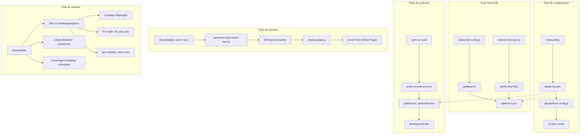

# Estructura del Proyecto SQUAD-AGENTES-IA

> Documento de referencia para entender la organización del código y la lógica del proyecto.

---

## Árbol de directorios

```
SQUAD-AGENTES-IA/
├── .kiro/                      # Configuración de agentes Kiro
│   ├── agents/                 # Custom Agents para Kiro CLI (terminal)
│   │   ├── scout.json                  # Explorador Jira/Confluence (ctrl+1)
│   │   ├── guardian.json               # QA Specialist: tests, Lighthouse (ctrl+2)
│   │   ├── historian.json              # Explorador del repo: git, grep (ctrl+3)
│   │   ├── github-repos.json           # Repos externos de la plataforma (ctrl+4)
│   │   └── datadog-alert.json          # Respuesta a alertas Datadog (ctrl+5)
│   ├── steering/               # Steering files (orquestador, onboarding, agentes)
│   │   ├── 00-swarm-orchestrator.md    # Orquestador (siempre activa)
│   │   ├── 01-plans-location.md        # Planes en Workspace/plans/
│   │   ├── 02-onboarding-first-interaction.md
│   │   ├── 03-validacion-agnostico-particular.md
│   │   ├── 04-playwright-cli-vs-mcp.md # Playwright Test vs Playwright MCP
│   │   ├── project-rules.md            # Reglas generales del proyecto
│   │   ├── agent-tech-guardian.md      # QA/Playwright (fileMatch: tests)
│   │   ├── agent-github-repos.md       # Lectura repos GitHub de la plataforma
│   │   ├── agent-po-agile.md           # PO: Historias de Usuario para Jira (INVEST)
│   │   ├── agent-doc-updater.md        # Experto en documentación (fileMatch: código, docs)
│   │   ├── agent-clarity-behavior.md   # Microsoft Clarity: métricas y sesiones (MCP)
│   │   └── vitest-cli.md              # Convenciones Vitest / scripts npm
│   ├── hooks/                  # 16 hooks de enforcement del enjambre (versionados)
│   │   ├── atlassian-write-guard.kiro.hook   # Solo Scout/PO-Agile/Cloud Datadog escriben en Jira
│   │   ├── chrome-devtools-guard.kiro.hook   # Solo Guardian usa Chrome DevTools MCP
│   │   ├── clarity-mcp-guard.kiro.hook       # Solo Clarity Behavior usa Clarity MCP
│   │   ├── datadog-mcp-guard.kiro.hook       # Solo Cloud Datadog usa Datadog MCP
│   │   ├── drawio-mcp-guard.kiro.hook        # Solo Doc Updater usa Draw.io MCP
│   │   ├── github-mcp-guard.kiro.hook        # Solo GitHub Repos/Cloud Datadog usan GitHub MCP
│   │   ├── playwright-mcp-guard.kiro.hook    # Solo Guardian usa Playwright MCP
│   │   ├── secrets-guard.kiro.hook           # Bloquea credenciales hardcodeadas
│   │   ├── git-safety-guard.kiro.hook        # Protege contra git destructivo
│   │   ├── jira-metadata-check.kiro.hook     # Valida metadata antes de crear issues
│   │   ├── swarm-delegation-enforcer.kiro.hook # Obliga delegación a especialista
│   │   ├── hardcoded-data-validator.kiro.hook  # Detecta datos que deben venir de config
│   │   ├── doc-updater-reminder.kiro.hook    # Recuerda actualizar docs/
│   │   ├── agnostico-particular-check.kiro.hook # Valida transversal vs particular
│   │   ├── lint-on-save.kiro.hook            # ESLint al guardar
│   │   └── post-task-tests.kiro.hook         # npm test tras completar tarea
│   ├── skills/                 # Skills especializados
│   │   ├── construir/         # Build y deploy
│   │   ├── prueba/            # Tests E2E y validación UI
│   │   └── diagramas-drawio/  # Diagramas Mermaid / Draw.io
│   ├── specs/                  # Especificaciones de features
│   └── settings/mcp.json      # Configuración MCP del workspace
│
├── docs/                       # Documentación y reportes publicados
│   ├── architecture/           # Diseño del sistema
│   ├── onboarding/             # Flujo primera interacción
│   ├── runbook/                # Guías operativas
│   ├── decisions/              # ADRs
│   ├── testing/                # Docs de testing (vitest-cli.md)
│   ├── analisis/               # Análisis en Markdown
│   ├── templates/              # Plantillas (platforms.example.json)
│   ├── Asset/                  # CSS/HTML para reportes
│   ├── data/                   # Datos de referencia (jira-cycle-*.json)
│   └── *.html                  # Reportes publicados (GitHub Pages)
│
├── miniverse/                  # Mundo de píxeles para agentes IA (ver docs/architecture/1-stack.md)
│   ├── src/                    # Frontend (Vite) + servidor (Express)
│   └── public/                 # world.json, assets
├── rules/                      # Reglas técnicas (Playwright, Datadog, PRD)
├── scripts/                    # Scripts de auditoría y config
│   ├── workspace-root.js       # Resuelve WORKSPACE_ROOT (artefactos)
│   ├── get-platform-config.js  # Lee platforms.json; usado por Playwright y audit
│   ├── audit-console-errors.js # Auditoría de consola (URL y zonas desde config)
│   ├── audit-data.js           # Helpers para auditoría
│   ├── audit-lighthouse.js     # Rendimiento (PageSpeed / Lighthouse)
│   └── demo-agentes-run.js     # Demo flujo agentes → demo-agentes.html
│
├── .githooks/                  # Git hooks (pre-commit: recordatorio Doc Updater)
│   ├── pre-commit
│   └── README.md
│
├── tests/
│   ├── smoke.spec.js           # E2E smoke (baseURL y smokePaths desde config)
│   ├── reportes.spec.js        # E2E índice reportes (GitHub Pages; REPORTES_BASE_URL)
│   ├── miniverse.spec.js       # E2E Miniverse (--project=miniverse)
│   └── unit/                   # Tests unitarios Vitest
│
├── tools/scripts/              # Scripts de reportes, deploy y automatización
│   ├── generate-cycle-report-html.js
│   ├── analyze-cycle-time.js
│   ├── deploy-pages.js
│   ├── regenerate-diagram-html.js
│   └── README.md
│
├── Workspace/                  # Artefactos generados (.gitignore); un árbol por producto
│   ├── <tu-plataforma>/        # WORKSPACE_ROOT (ej. mi-app)
│   │   ├── config/platforms.json
│   │   ├── reports/ audit/ playwright/ plans/ observabilidad/ repos/ data/
│   └── <otra-plataforma>/     # Misma forma de carpetas (otro producto)
│
├── playwright.config.js        # baseURL desde get-platform-config
├── vitest.config.js
└── package.json
```

---

## Lógica del proyecto

### Flujo de configuración

1. **Onboarding**: Si no existe `{WORKSPACE_ROOT}/config/platforms.json`, seguir `docs/onboarding/01-flujo-primera-interaccion.md`.
2. **Config central**: `platforms.json` define URLs, smokePaths, auditZones, Jira y Datadog por plataforma.
3. **Scripts y tests** leen la config vía `scripts/get-platform-config.js`.

### Flujo de tests E2E

```
playwright.config.js → getBaseUrl() → platforms.json
tests/smoke.spec.js  → getSmokePaths() → platforms.json
```

### Flujo de auditoría

```
npm run audit → audit-console-errors.js → getBaseUrl(), getAuditZones()
             → Workspace/audit/ (JSON, screenshots)
```

### Flujo de reportes

```
docs/data/jira-cycle-*.json → generate-cycle-report-html.js → Workspace/reports/
                           → deploy-pages.js → docs/*.html (GitHub Pages)
```

### Flujo de agentes

```
Orquestador (00-swarm-orchestrator) → subagentes → especialistas según mapa
  · Plan en Workspace/plans/
  · Validación Playwright (Guardian / skill prueba)
  · Repos plataforma (GitHub Repos)
  · HU Jira (PO-Agile)
  · Docs vivos (Doc Updater; recordatorio pre-commit)
  · Validación alertas Datadog (Cloud Agent)
  · Microsoft Clarity en producción (Clarity Behavior)
```


### Diagrama de flujos (vista integrada)



> **[Abrir en Draw.io](diagrams/flujo-estructura.html)** — Editar diagrama en la aplicación

📄 **Documento visual para negocio:** [architecture/5-agents-functional-architecture.md](./architecture/5-agents-functional-architecture.md)

---

## Separación código vs artefactos

| Ubicación | Versionado | Contenido |
|-----------|------------|-----------|
| `tests/`, `scripts/`, `tools/`, `docs/` (excepto reportes generados) | Sí | Código fuente y documentación |
| `Workspace/` | No (.gitignore) | Resultados de agentes, config, reportes, audit |
| `docs/*.html` (reportes) | Sí | Publicados por `deploy:pages` para GitHub Pages |

---

## Referencias

- [resumen-proyecto.md](./resumen-proyecto.md) — Contexto principal para IA
- [architecture/4-workspace.md](./architecture/4-workspace.md) — Detalle del Workspace
- [onboarding/01-flujo-primera-interaccion.md](./onboarding/01-flujo-primera-interaccion.md) — Primera interacción
