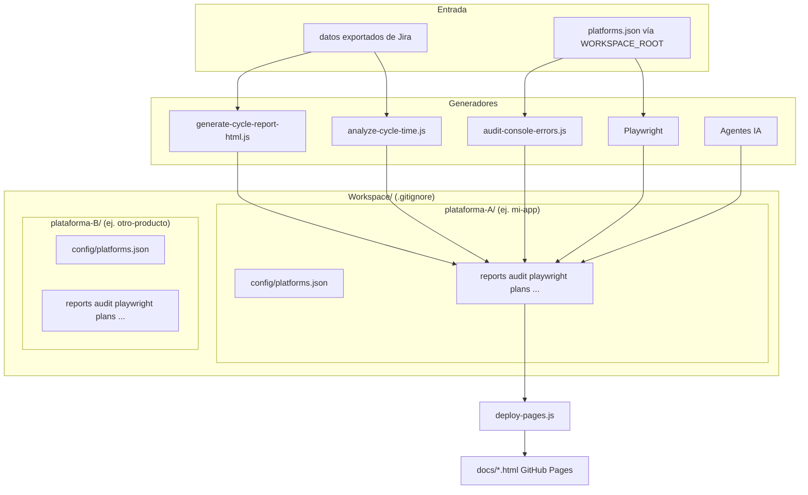

# Workspace: resultados del trabajo de agentes

Workspace almacena los resultados del trabajo de cada agente (scripts, tests, agentes IA). Esta carpeta está en `.gitignore` para mantener la separación estricta entre código fuente y artefactos generados.

## Diagrama: flujo de datos y generadores



> **[Abrir en Draw.io](../diagrams/flujo-workspace.html)** — Editar diagrama en la aplicación

## Estructura

En la raíz de `Workspace/` viven **árboles por producto/plataforma** y opcionalmente una carpeta de tribu. Cada producto incluye la misma forma de carpetas:

```
Workspace/
├── Tribu XXXXX/                 # Reportes y planes transversales de la tribu
│   ├── reports/
│   └── plans/
├── <plataforma-A>/              # WORKSPACE_ROOT para la plataforma A
│   ├── config/platforms.json    # Configuración de la plataforma
│   ├── reports/
│   ├── audit/
│   ├── observabilidad/
│   ├── repos/
│   ├── playwright/
│   ├── plans/
│   └── data/
└── <plataforma-B>/              # Otra plataforma (misma estructura)
    ├── config/platforms.json
    ├── reports/
    ├── audit/
    ├── observabilidad/
    ├── repos/
    ├── playwright/
    ├── plans/
    └── data/
```

## Workspaces por producto

| Carpeta | Descripción |
|---------|-------------|
| `Workspace/Tribu XXXXX/` | Reportes y planes transversales de la tribu |
| `Workspace/<plataforma>/` | Artefactos específicos de cada plataforma |

Variable de entorno (desde la raíz del repo):

```bash
export WORKSPACE_ROOT=Workspace/<tu-plataforma>
```

Los scripts resuelven rutas con `scripts/workspace-root.js`. **Debes definir `WORKSPACE_ROOT`** para que los scripts sepan dónde guardar artefactos (ej. `Workspace/mi-app`).

## Configuración de plataformas

`{WORKSPACE_ROOT}/config/platforms.json` contiene la configuración por plataforma. Opcionalmente, `scripts/get-platform-config.js` acepta **`PLATFORMS_CONFIG_PATH`** (ruta absoluta o relativa al repo) para apuntar a otro JSON sin cambiar `WORKSPACE_ROOT`.

- **URLs**: app, staging, docs
- **smokePaths**: rutas para tests E2E (`tests/smoke.spec.js`)
- **auditZones**: zonas para auditoría de consola (name, url)
- **Jira**: projectKey, projectUrl, tablero de incidentes, tablero de incidentes de seguridad
- **Datadog**: site, dashboardIds, monitorTags

Se crea en la **primera interacción** siguiendo `docs/onboarding/01-flujo-primera-interaccion.md`. Plantilla: `docs/templates/platforms.example.json`.

## Subcarpetas

| Carpeta | Generador | Contenido |
|---------|-----------|-----------|
| `reports/` | `tools/scripts/generate-cycle-report-html.js`, `tools/scripts/analyze-cycle-time.js` | `analisis-ciclo-desarrollo.html`, `analisis-ciclo-desarrollo.md` |
| `audit/` | `scripts/audit-console-errors.js`, `scripts/audit-lighthouse.js` | `console-audit-report.json`, `screenshots/`, `lighthouse/` |
| `playwright/` | Playwright, `tools/scripts/create-cursor-automation.js` | `test-results/`, `playwright-report/`, `cursor-browser-state/` |
| `plans/` | Agentes IA (Cursor) | Planes generados por el orquestador |
| `observabilidad/` | Análisis Datadog | Runbooks, mapeo servicio↔repo |
| `repos/` | Clonación manual | Repos externos de la plataforma |
| `data/` | Opcional | Datos exportados |

## Publicación en GitHub Pages

Los reportes HTML en `{WORKSPACE_ROOT}/reports/` no se publican automáticamente porque `Workspace/` está en `.gitignore`. Para publicar:

```bash
npm run deploy:pages
```

Este comando regenera los reportes y los copia a `docs/` para que GitHub Pages los sirva. Luego hacer commit y push.

## Datos de entrada

Los scripts de reportes leen datos exportados que se almacenan en `{WORKSPACE_ROOT}/data/` (ej. exports de Jira). Esos archivos son datos particulares de cada plataforma y no se versionan.

## Screenshots de auditoría

Las capturas de auditoría están en `{WORKSPACE_ROOT}/audit/screenshots/`. Al ejecutar `npm run deploy:pages`, se copian a `docs/screenshots-auditoria/` para publicación en GitHub Pages.
