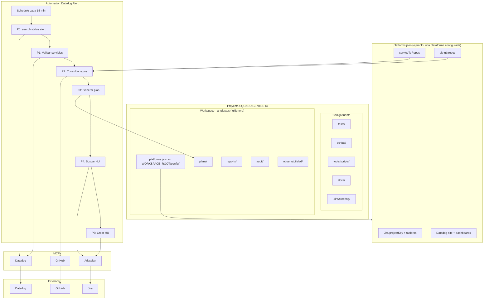

# Esquema del proyecto SQUAD-AGENTES-IA

> Vista general de componentes, flujos y configuraciones.

---

## Diagrama principal

> **Editar en Draw.io:** Abre [diagrams.net](https://app.diagrams.net) → Arrange → Insert → Advanced → Mermaid, y pega el contenido de [diagrams/esquema-proyecto-completo.mmd](../diagrams/esquema-proyecto-completo.mmd).

### Diagramas de análisis: Agnóstico vs Particular

| Diagrama | Descripción |
|----------|-------------|
| [Esquema funcionamiento agnóstico](./diagrams/esquema-funcionamiento-agnostico.html) | Flujos transversales: onboarding, E2E, auditoría, reportes, agentes |
| [Esquema acciones particulares](./diagrams/esquema-acciones-particulares.html) | Acciones específicas del proyecto: Automation Datadog, Jira, serviceToRepos (datos en platforms.json) |

---

## Resumen por capa

| Capa | Componentes |
|------|-------------|
| **Código** | tests/, scripts/, tools/scripts/, miniverse/, docs/, .kiro/steering/ |
| **Workspace** | Por producto bajo `Workspace/<nombre>/`: `config/platforms.json`, `plans/`, `reports/`, `audit/`, `observabilidad/`, `playwright/`, etc. (ver `docs/architecture/4-workspace.md`) |
| **Config** | Por plataforma en platforms.json (Jira, Datadog, serviceToRepos, github.repos) |
| **Automation** | Schedule → 6 pasos (MCP Datadog → validar → repos → plan → Jira) |
| **MCPs** | Datadog, Atlassian, GitHub |
| **Externos** | Datadog, Jira, GitHub |

---

## Flujos principales

| Flujo | Entrada | Salida |
|-------|---------|--------|
| **Automation Datadog** | Schedule + MCP Datadog `status:alert` | plan en plans/, HU en Jira |
| **Tests E2E** | platforms.json (baseURL, smokePaths) | playwright report |
| **Auditoría** | platforms.json (auditZones) | Workspace/audit/ |
| **Reportes** | jira-cycle-*.json | Workspace/reports/ → deploy:pages |

---

## Ejemplo de configuración local (no versionada)

Los valores concretos viven en `{WORKSPACE_ROOT}/config/platforms.json` (`.gitignore`; ver `docs/architecture/4-workspace.md`). La plantilla puede rellenarse así (los números pueden cambiar según el JSON):

| Sección | Ejemplo de contenido |
|---------|----------------------|
| **Jira** | projectKey, URLs de proyecto, tableros de incidentes y seguridad |
| **Datadog** | site (`us1`, etc.), IDs de dashboards, `serviceToRepos` |
| **serviceToRepos** | Mapa servicio Datadog → repos GitHub (varias entradas) |
| **github.repos** | Lista de repos de la plataforma bajo la org configurada |

---

## Referencias

- [ESTRUCTURA.md](./ESTRUCTURA.md) — Árbol de directorios
- [runbook/automation-datadog-alert.md](./runbook/automation-datadog-alert.md) — Flujo de automation
- [architecture/0-overview.md](./architecture/0-overview.md) — Visión general
