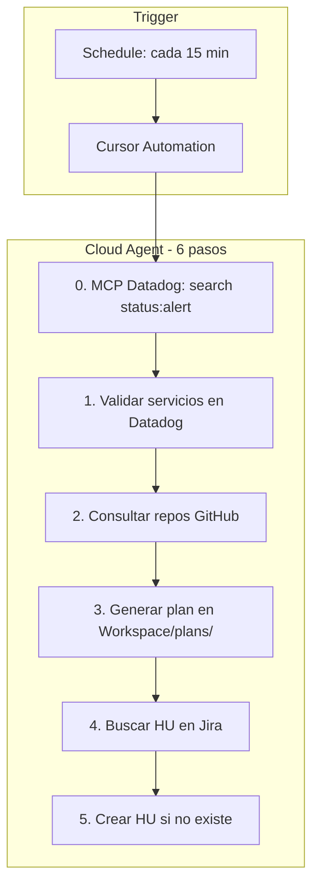

# Runbook: Automatización Datadog → Cursor (Alertas)

> Automatización que obtiene las alertas de Datadog vía **MCP** (sin webhook), valida servicios, consulta repos, genera un plan de trabajo y crea o verifica la HU en Jira.

---

## Objetivo

Un Cloud Agent de Cursor se ejecuta **en horario** (ej. cada 15 min) y:

0. **Obtener** monitores en alerta desde Datadog (MCP `search_datadog_monitors` con `status:alert`)
1. **Validar** los servicios alertados en Datadog
2. **Consultar** los repositorios necesarios para entender la causa
3. **Generar** un plan de trabajo en `Workspace/plans/`
4. **Validar** si existe una HU en Jira para esta alerta
5. **Crear** la HU si no existe

> **No se requiere webhook.** La información de alertas se obtiene directamente del MCP de Datadog.

---

## Diagrama del flujo



> **[Abrir en Draw.io](../diagrams/flujo-automation-datadog-alert.html)** — Editar diagrama en la aplicación.

---

## Requisitos previos

- [ ] MCP **Atlassian** configurado (Jira)
- [ ] MCP **Datadog** configurado (dominio sin placeholder)
- [ ] MCP **GitHub** configurado
- [ ] `config/platforms.json` del workspace activo con Jira, Datadog y GitHub por plataforma
- [ ] Cuenta Cursor con acceso a [cursor.com/automations](https://cursor.com/automations)
- [ ] **No se requiere** configurar webhook en Datadog (se usa MCP)

---

## Paso 1: Crear la automatización en Cursor

**Opción A — Script Playwright (semi-automático):**

```bash
npm run automation:create-cursor
```

El script abre el navegador, navega a cursor.com/automations e intenta crear la automatización. La primera vez puede pedir login manual. Si la UI ha cambiado, completa los pasos manualmente cuando el script pause.

**Opción B — Manual:**

1. Ir a **[cursor.com/automations](https://cursor.com/automations)** y crear una nueva automatización.
2. **Trigger:** Seleccionar **Scheduled** (ej. cada 15 minutos o cada hora). **No usar Webhook** — las alertas se obtienen vía MCP Datadog.
3. **Repositorio:** Seleccionar `SQUAD-AGENTES-IA` (o el repo donde esté el proyecto).
4. **Rama:** `main` (o la rama principal).
5. **Guardar** la automatización.

### Herramientas (Tools) a habilitar

| Herramienta | Uso |
|-------------|-----|
| **MCP - Atlassian** | Buscar y crear issues en Jira |
| **MCP - Datadog** | Consultar monitors, logs, métricas |
| **MCP - GitHub** | Leer repos, archivos, PRs |
| **Memories** | Opcional: recordar patrones de alertas |

### Prompt

Copiar el contenido de `docs/templates/automation-datadog-alert-prompt.md` en el campo de prompt de la automatización.

### Acceso a platforms.json en Cloud Agent

El Cloud Agent clona el repo; `Workspace/` está en `.gitignore`, por lo que **no tendrá** `{WORKSPACE_ROOT}/config/platforms.json`.

**Solución:** Configurar `PLATFORMS_JSON` en [Cursor Cloud Agents](https://cursor.com/dashboard?tab=cloud-agents) → Environment con el contenido completo de `platforms.json` (como string JSON). El prompt indica al agente que lea esta variable si no encuentra el archivo.

Alternativa: incluir una copia de config en una ruta versionada (ej. `config/platforms.json` en la raíz del repo) para que el agente la lea directamente.

### Variables de entorno (Cloud Agents Dashboard)

En [Cursor Cloud Agents](https://cursor.com/dashboard?tab=cloud-agents) → Environment, configurar:

| Variable | Descripción | Ejemplo |
|----------|-------------|---------|
| `PLATFORMS_JSON` | **Requerido** si Workspace no está disponible. JSON completo de `platforms.json` | Copiar contenido del archivo |
| `JIRA_CLOUD_ID` | Cloud ID de Atlassian. Obtener en: Jira → Configuración → Sistema → Información. Requerido para MCP Jira | UUID |
| `JIRA_PROJECT_KEY` | Clave del proyecto Jira para HUs | `PROJ` |

---

## Paso 2: Mapeo servicio → repositorio

Para que el agente sepa qué repos consultar según el servicio alertado, configurar en `platforms.json`:

```json
{
  "datadog": {
    "site": "us1",
    "serviceToRepos": {
      "nombre-servicio": ["org/repo-frontend", "org/repo-api"],
      "otro-servicio": ["org/repo-backend"]
    }
  },
  "github": {
    "org": "mi-org",
    "repos": ["repo-frontend", "repo-backend"]
  }
}
```

- `serviceToRepos`: mapeo opcional de tags/servicios de Datadog a repos de GitHub.
- Si no existe, el agente usará `github.repos` de la plataforma por defecto.

---

## Flujo detallado del agente

### 0. Obtener monitores en alerta

- Usar MCP Datadog `search_datadog_monitors` con query `status:alert`.
- Si no hay resultados, terminar.

### 1. Validar servicios en Datadog

- Usar MCP Datadog para obtener detalles del monitor (id del Paso 0).
- Consultar logs, métricas o traces relacionados con la alerta.
- Extraer: servicio, host, tags, query, mensaje de error.

### 2. Consultar repositorios

- Identificar repos desde `serviceToRepos` o `github.repos`.
- Usar MCP GitHub para leer archivos relevantes (config, código del servicio).
- Buscar en el código referencias al error, métrica o componente alertado.

### 3. Generar plan de trabajo

- Crear archivo en `Workspace/plans/` con nombre `plan-alerta-{ALERT_ID}-{timestamp}.md`.
- Incluir: resumen de la alerta, análisis, pasos propuestos, repos afectados.

### 4. Validar HU en Jira

- Buscar en Jira con JQL: `project = PROJ AND summary ~ "ALERT_TITLE" OR description ~ "ALERT_ID"`.
- Usar `searchJiraIssuesUsingJql` del MCP Atlassian.

### 5. Crear HU si no existe

- Si no hay resultados, usar `createJiraIssue`:
  - `issueTypeName`: "Story" o "Task"
  - `summary`: título descriptivo de la alerta
  - `description`: contexto de la alerta, link a Datadog, plan generado

---

## Salidas esperadas

| Paso | Artefacto |
|------|-----------|
| 1 | Resumen de la alerta (servicio, métrica, scope) |
| 2 | Contexto de código de los repos |
| 3 | `Workspace/plans/plan-alerta-{id}.md` |
| 4 | HU existente o indicación de que no existe |
| 5 | Nueva HU en Jira con key (ej. PROJ-123) |

---

## Validación del flujo end-to-end

### Checklist previo

- [ ] MCPs Atlassian, Datadog y GitHub conectados a la automation
- [ ] `PLATFORMS_JSON` configurado en Cloud Agents (o `platforms.json` accesible)
- [ ] `datadog.serviceToRepos` y `github.repos` poblados en platforms.json
- [ ] Trigger Scheduled activo (ej. cada 15 min)
- [ ] `jira.cloudId` obtenido de Atlassian si el MCP lo requiere

### Cómo simular

1. **Monitor en alerta:** Crear un monitor de prueba en Datadog o esperar a que uno existente entre en estado `alert`.
2. **Ejecución manual:** En cursor.com/automations, ejecutar la automation manualmente (Run) con el prompt actual.
3. **Esperar schedule:** Dejar que el trigger programado dispare la ejecución.

### Qué verificar tras la ejecución

| Artefacto | Ubicación |
|-----------|-----------|
| Plan generado | `Workspace/plans/plan-alerta-{id}-{timestamp}.md` |
| HU en Jira | Buscar por título del monitor o `ALERT_ID` en description |
| Sin duplicados | El agente debe buscar antes de crear; no debe crear HUs repetidas |

---

## Troubleshooting

| Problema | Solución |
|----------|----------|
| No se encuentran monitores en alerta | Verificar query `status:alert`; el MCP usa el site configurado en Datadog |
| Agente no encuentra platforms.json | Configurar `PLATFORMS_JSON` en Cloud Agents |
| MCP Datadog falla | Revisar skill `datadog-mcp-setup`, dominio correcto |
| No se crea HU | Verificar cloudId, projectKey y permisos en Jira |
| Repos no encontrados | Revisar `github.org` y `github.repos` en platforms.json |

---

## Referencias

- [Cursor Automations](https://cursor.com/docs/cloud-agent/automations)
- [Cursor Triggers - Scheduled](https://cursor.com/docs/cloud-agent/automations#scheduled-triggers)
- Plantilla de prompt: `docs/templates/automation-datadog-alert-prompt.md`
- Config plataformas: `docs/templates/platforms.example.json`
