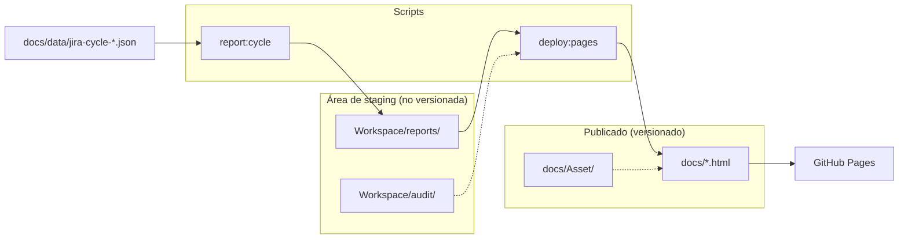

# Runbook: Publicar en GitHub Pages

Los reportes HTML en `docs/` se publican en GitHub Pages para acceso desde la web.

## URL del sitio

- **Repositorio SQUAD-AGENTES-IA:**  
  `https://carlospatinovelez19.github.io/prueba-agente-po/`

- **Repositorio carlospatinovelez19.github.io (si se usa como sitio principal):**  
  `https://carlospatinovelez19.github.io/`

## Configuración en GitHub

Hay dos modos posibles (no uses los dos a la vez para el mismo sitio):

### A) Rama + carpeta `/docs` (reportes y `docs/*.html`)

1. **Settings** → **Pages**
2. **Source:** Deploy from a branch
3. **Branch:** `main` (o la rama principal)
4. **Folder:** `/docs`
5. Guardar

### B) GitHub Actions (Miniverse)

Si **Source** es **GitHub Actions**, el sitio publicado es el artefacto del workflow (build de `miniverse/dist`). El workflow `.github/workflows/deploy-miniverse-github-pages.yml` **copia** además casi todo `docs/`: HTML de reportes (excepto `docs/index.html`, para no sustituir el `index.html` del SPA de Vite), `Asset/`, `data/`, `diagrams/*.html` y `screenshots-auditoria/` si existen. Cualquier cambio bajo `docs/**` dispara el deploy en push a `main`. Tras cambiar el workflow, hace falta push o **Actions** → ejecutar el workflow manualmente.

## Reportes disponibles

| Reporte | URL relativa | Estado |
|---------|--------------|--------|
| Inicio (Reporte Ejecutivo Entregables) | `index.html` | ✅ Publicado |
| Índice de reportes | `reportes.html` | ✅ Publicado |
| Reporte Ejecutivo standalone | `reporte-ejecutivo-valor-proyecto.html` | ✅ Publicado |
| Análisis ciclo de desarrollo | `analisis-ciclo-desarrollo.html` | ✅ Generado por `deploy:pages` |
| Auditoría errores consola | `auditoria-errores-consola.html` | ⏳ Pendiente (no hay generador HTML) |
| Reporte plataforma | `reporte-<plataforma>-<periodo>.html` | ⏳ Pendiente (generado por plataforma) |
| Agentes, MCPs, CLIs, Skills y actividades | `diagrams/agentes-mcps-cli-skills-actividades.html` | ✅ Versionado en `docs/diagrams/` |

**Importante:** No añadir enlaces en `reportes.html` ni `index.html` a páginas que no existan en `docs/`, para evitar 404 en GitHub Pages.

## Plantillas (docs/Asset/)

Las plantillas CSS y HTML para reportes están en `docs/Asset/`:
- `report-base.css` — variables y layout base
- `report-components.css` — componentes (cards, tablas, badges, footer)
- `report-index.css` — estilos del índice de reportes
- `template-report.html` / `template-report-index.html` — plantillas HTML de referencia

## Staging y rutas Asset

Los reportes se generan en `Workspace/reports/` (área de staging, no versionada). Los HTML usan rutas relativas:

```html
<link rel="stylesheet" href="Asset/report-base.css">
<link rel="stylesheet" href="Asset/report-components.css">
```

- **En Workspace/reports/**: La ruta `Asset/` no resuelve (no existe `Workspace/reports/Asset/`). El reporte no mostrará estilos si se abre localmente desde ahí.
- **En docs/**: La ruta `Asset/` resuelve a `docs/Asset/` correctamente. GitHub Pages sirve `docs/`, por lo que los estilos cargan bien.

**Importante:** `deploy:pages` es el paso obligatorio antes de commit. Sin ejecutarlo, los reportes en `docs/` quedarían desactualizados y GitHub Pages no mostraría los estilos correctamente para los reportes generados.

## Filtro por plataforma

La página `reportes.html` incluye un selector de plataforma que carga desde `docs/data/platforms.json`. Este archivo se copia automáticamente desde `{WORKSPACE_ROOT}/config/platforms.json` al ejecutar `deploy:pages`. Si no existe `platforms.json`, el filtro no se muestra.

## Flujo de publicación (deploy:pages)



> **[Abrir en Draw.io](../diagrams/flujo-github-pages.html)** — Editar diagrama en la aplicación

Los reportes se generan en `Workspace/reports/` (no versionado). Para publicarlos en GitHub Pages:

1. **Regenerar y copiar a docs:**

   ```bash
   npm run deploy:pages
   ```

   Este comando ejecuta `report:cycle` y copia los HTML generados a `docs/`.

2. **Commit y push:**

   ```bash
   git add docs/
   git commit -m "Actualizar reportes para GitHub Pages"
   git push
   ```

## Regenerar reporte de ciclo de desarrollo (solo local)

```bash
npm run report:cycle
```

Genera en `Workspace/reports/`. Requiere `docs/data/jira-cycle-2025.json` (exportado desde Jira con los campos de tiempo).
